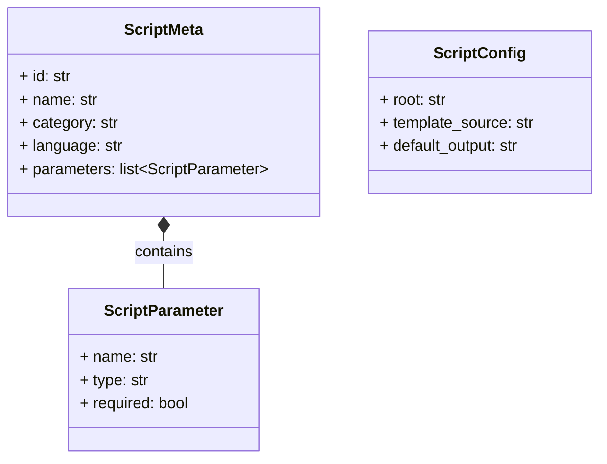

# Scripts System — Milestone 3: Class Diagram Generator Script

> **Status**: Planning — Iteration 1
> **Parent**: `.agent/plans/scripts-system.md`
> **Milestone**: M3 — The First Concrete Script
> **Depends on**: M1 (Execution Framework), M2 (Shared Libraries)
> **Unlocks**: M4 (Interfaces — CLI/API/UI), M5 (Route Quality Audit)

---

## 0. What This Milestone Delivers

After M3 is complete:

1. A **Class Diagram Generator** script exists — the first real script in the system
2. It lives in `src/core/data/script_templates/generators/class_diagrams.py` — a template script
3. It uses the M1 framework — discoverable by the registry, executable by the executor
4. It uses the M2 shared libraries — code_analyzer, graph_builder, mermaid_generator, report_formatter
5. It produces **Mermaid class diagrams** for any Python project (or scoped package)
6. The output is a markdown report with embedded Mermaid diagrams
7. End-to-end proof: `execute_script("generators/class_diagrams")` → report on disk, run in ledger, events on SSE

**What you can do after M3**: Generate class diagrams for any package in the project. See the run in the ledger. Stream the output in real-time via SSE. The script system is validated end-to-end.

---

## 1. What the Script Does

### 1.1 Input

The script accepts:
- **scope** (optional): Limit to a specific package (e.g., `core.services.vault`, `core.services.scripts`)
  - If not provided, analyzes the entire `src/` directory
- **output** (optional): Output directory for the report
  - Falls back to `SCRIPT_OUTPUT_DIR` env var → meta default → system default
- **format** (optional): Output format — `mermaid` (default), `json`, `markdown`
  - `mermaid` = markdown report with Mermaid diagrams
  - `json` = raw graph data as JSON
  - `markdown` = markdown report without diagrams, just tables
- **max-depth** (optional): Maximum package depth for grouping (default: 3)
  - Controls how many levels of namespace → subgraph nesting
- **include-private** (optional, boolean): Include `_private` classes (default: false)

### 1.2 Output

For the default Mermaid format, the script produces a markdown file:

```markdown
# Class Diagram — core.services.scripts

> Generated by Class Diagram Generator on 2026-03-08T12:00:00Z

## Summary

| Metric | Value |
|--------|-------|
| Files analyzed | 5 |
| Classes found | 8 |
| Inheritance relationships | 3 |
| Composition relationships | 5 |
| Dependency relationships | 12 |
| Packages | 2 |

## Package: core.services.scripts



## Orphan Classes

Classes with no detected relationships:

| Class | File | Lines |
|-------|------|-------|
| OutputRouter | output_router.py | 45-89 |
```

### 1.3 The Pipeline

```
1. Read parameters (CLI args or env vars)
2. Discover Python files (file_discovery)
3. Analyze project (code_analyzer → ProjectAnalysis)
4. Build class graph (graph_builder → ClassGraph)
5. If scope specified, filter graph by package
6. Generate Mermaid diagrams per package (mermaid_generator)
7. Generate orphan class table
8. Build report (report_formatter → markdown)
9. Write report to output directory
10. Print summary to stdout (captured by stream_subprocess)
```

---

## 2. Script Metadata Header

```python
#!/usr/bin/env python3
"""
@script
name: Class Diagram Generator
category: generator
mode: fully_automated
tags: mermaid, diagrams, docs, python, class-diagram
default_output: docs/diagrams/
output_formats: mermaid, json, markdown
requires_tools: (none)
timeout: 120
description: Generates Mermaid class diagrams from Python source code.
    Analyzes class definitions, inheritance, composition, and dependencies.
    Produces markdown reports with embedded Mermaid syntax.

@param scope: string | Package scope — limit analysis to a specific package (e.g., core.services.vault)
@param output: path = docs/diagrams/ | Output directory for generated diagrams
@param format: choice = mermaid [mermaid, json, markdown] | Output format
@param max-depth: integer = 3 | Maximum package nesting depth for diagram grouping
@param include-private: boolean = false | Include _private classes in diagrams
"""
```

This header is parsed by M1's registry to discover the script.

---

## 3. Script Implementation Structure

```python
# src/core/data/script_templates/generators/class_diagrams.py

#!/usr/bin/env python3
"""
@script
name: Class Diagram Generator
... (header from §2)
"""

import sys
import os
import argparse
from pathlib import Path


def main() -> int:
    """Main entry point for the class diagram generator.
    
    Returns exit code: 0 = success, 1 = error.
    """
    args = parse_args()
    
    project_root = Path(os.environ.get("SCRIPT_PROJECT_ROOT", ".")).resolve()
    output_dir = Path(
        args.output
        or os.environ.get("SCRIPT_OUTPUT_DIR", "docs/diagrams")
    )
    output_format = (
        args.format
        or os.environ.get("SCRIPT_OUTPUT_FORMAT", "mermaid")
    )
    
    # ── Step 1: Analyze ──────────────────────────────────────────
    print(f"📊 Analyzing Python code in {project_root}...")
    
    from src.core.data.script_templates.lib.code_analyzer import (
        analyze_python_project,
    )
    
    analysis = analyze_python_project(
        project_root,
        source_dir=args.scope or "src",
        include_private=args.include_private,
    )
    
    print(f"   Found {analysis.total_classes} classes in {analysis.files_analyzed} files")
    
    if analysis.total_classes == 0:
        print("⚠️  No classes found. Nothing to diagram.")
        return 0
    
    # ── Step 2: Build graph ────────────────────────────────────
    print("🔗 Building relationship graph...")
    
    from src.core.data.script_templates.lib.graph_builder import (
        build_class_graph,
    )
    
    graph = build_class_graph(
        analysis,
        scope=args.scope,
    )
    
    print(f"   {len(graph.nodes)} nodes, {len(graph.edges)} edges")
    
    # ── Step 3: Render ─────────────────────────────────────────
    if output_format == "json":
        content = _render_json(graph, analysis)
        filename = "class_diagram.json"
    elif output_format == "markdown":
        content = _render_markdown_only(graph, analysis)
        filename = "class_diagram.md"
    else:  # mermaid (default)
        content = _render_mermaid_report(graph, analysis, args)
        filename = "class_diagram.md"
    
    # ── Step 4: Write output ───────────────────────────────────
    from src.core.data.script_templates.lib.report_formatter import write_report
    
    output_path = write_report(content, output_dir, filename)
    print(f"✅ Report written to {output_path}")
    
    return 0


def _render_mermaid_report(graph, analysis, args) -> str:
    """Render the full Mermaid report with diagrams."""
    from src.core.data.script_templates.lib.mermaid_generator import (
        render_class_diagram,
        MermaidConfig,
    )
    from src.core.data.script_templates.lib.report_formatter import (
        markdown_report,
        mermaid_block,
        summary_table,
    )
    
    config = MermaidConfig(
        max_fields=10,
        max_methods=15,
        group_by_package=True,
        show_visibility=True,
    )
    
    # Generate diagram per package (or one big diagram if small enough)
    mermaid_content = render_class_diagram(graph, config=config)
    
    # Build summary
    summary = {
        "Files analyzed": str(analysis.files_analyzed),
        "Classes found": str(analysis.total_classes),
        "Inheritance relationships": str(
            sum(1 for e in graph.edges if e.relation.value == "inherits")
        ),
        "Composition relationships": str(
            sum(1 for e in graph.edges if e.relation.value == "composes")
        ),
        "Dependency relationships": str(
            sum(1 for e in graph.edges if e.relation.value == "depends")
        ),
    }
    
    # Build sections
    sections = [
        {
            "title": "Class Diagram",
            "content": mermaid_block(mermaid_content),
        },
    ]
    
    # Add orphan classes section
    orphans = graph.get_orphan_nodes()
    if orphans:
        orphan_rows = []
        for node_id in orphans:
            node = graph.nodes[node_id]
            orphan_rows.append({
                "Class": node.label,
                "Package": node.package,
                "File": node.metadata.get("file", ""),
            })
        sections.append({
            "title": "Orphan Classes",
            "content": (
                "Classes with no detected relationships:\n\n"
                + summary_table(orphan_rows)
            ),
        })
    
    scope_label = args.scope or "Full Project"
    
    return markdown_report(
        title=f"Class Diagram — {scope_label}",
        summary=summary,
        sections=sections,
        metadata={
            "script": "Class Diagram Generator",
            "scope": scope_label,
        },
    )


def _render_json(graph, analysis) -> str:
    """Render graph data as JSON."""
    from src.core.data.script_templates.lib.report_formatter import json_report
    
    return json_report(
        title="Class Diagram Data",
        data={
            "nodes": [
                {
                    "id": n.id,
                    "label": n.label,
                    "kind": n.kind,
                    "package": n.package,
                    "fields": n.fields,
                    "methods": n.methods,
                }
                for n in graph.nodes.values()
            ],
            "edges": [
                {
                    "source": e.source,
                    "target": e.target,
                    "relation": e.relation.value,
                    "label": e.label,
                }
                for e in graph.edges
            ],
        },
    )


def _render_markdown_only(graph, analysis) -> str:
    """Render as markdown tables (no Mermaid diagrams)."""
    from src.core.data.script_templates.lib.report_formatter import (
        markdown_report,
        summary_table,
    )
    
    class_rows = [
        {
            "Class": n.label,
            "Kind": n.kind,
            "Package": n.package,
            "Fields": str(len(n.fields)),
            "Methods": str(len(n.methods)),
        }
        for n in graph.nodes.values()
    ]
    
    edge_rows = [
        {
            "From": e.source.split(".")[-1],
            "Relation": e.relation.value,
            "To": e.target.split(".")[-1],
        }
        for e in graph.edges
    ]
    
    sections = [
        {"title": "Classes", "content": summary_table(class_rows)},
        {"title": "Relationships", "content": summary_table(edge_rows)},
    ]
    
    return markdown_report(
        title="Class Diagram — Tabular",
        summary={"Classes": str(len(graph.nodes)), "Relationships": str(len(graph.edges))},
        sections=sections,
    )


def parse_args() -> argparse.Namespace:
    """Parse command-line arguments.
    
    Parameters match the @param declarations in the script header.
    """
    parser = argparse.ArgumentParser(
        description="Generate Mermaid class diagrams from Python source code.",
    )
    parser.add_argument(
        "--scope", default=None,
        help="Package scope (e.g., core.services.vault)",
    )
    parser.add_argument(
        "--output", default=None,
        help="Output directory for generated diagrams",
    )
    parser.add_argument(
        "--format", default=None, choices=["mermaid", "json", "markdown"],
        help="Output format (default: mermaid)",
    )
    parser.add_argument(
        "--max-depth", type=int, default=3,
        help="Maximum package nesting depth (default: 3)",
    )
    parser.add_argument(
        "--include-private", action="store_true",
        help="Include _private classes in diagrams",
    )
    return parser.parse_args()


if __name__ == "__main__":
    sys.exit(main())
```

---

## 4. How the Script Integrates With M1

### 4.1 Discovery

The registry (M1) discovers this script because:
1. It lives in `src/core/data/script_templates/generators/class_diagrams.py`
2. The registry scans template directories based on `template_source` config
3. The file has an `@script` header → metadata is parsed into `ScriptMeta`

```python
# What the registry produces:
ScriptMeta(
    id="generators/class_diagrams",
    name="Class Diagram Generator",
    category="generator",
    language="python",
    mode="fully_automated",
    tags=["mermaid", "diagrams", "docs", "python", "class-diagram"],
    default_output="docs/diagrams/",
    output_formats=["mermaid", "json", "markdown"],
    timeout=120,
    source="template",
    path="/abs/path/to/src/core/data/script_templates/generators/class_diagrams.py",
    relative_path="generators/class_diagrams.py",
    parameters=[
        ScriptParameter(name="scope", type="string", description="Package scope..."),
        ScriptParameter(name="output", type="path", default="docs/diagrams/", ...),
        ScriptParameter(name="format", type="choice", default="mermaid", choices=["mermaid", "json", "markdown"], ...),
        ScriptParameter(name="max-depth", type="integer", default="3", ...),
        ScriptParameter(name="include-private", type="boolean", default="false", ...),
    ],
)
```

### 4.2 Execution

When `execute_script("generators/class_diagrams", params={"scope": "core.services.scripts"})` is called:

1. **Registry**: Looks up `ScriptMeta` by ID
2. **Executor builds command**: `[sys.executable, "/path/to/class_diagrams.py", "--scope", "core.services.scripts"]`
3. **Executor injects env**: `SCRIPT_OUTPUT_DIR`, `SCRIPT_PROJECT_ROOT`, `SCRIPT_ID`, ...
4. **tracked_run()**: Creates a Run with type="script", subtype="script:generators/class_diagrams"
5. **stream_run()**: Executes the subprocess, streams stdout lines as `stream:line` events
6. **Result**: `{"ok": True, "run_id": "...", "output_path": "docs/diagrams/class_diagram.md"}`

### 4.3 User Override

A user can override this template script by:
1. Creating `scripts/my_class_diagrams.py` with `@override: generators/class_diagrams` in its header
2. The registry marks the template as overridden → user's version is used instead
3. The user's script can be completely custom, or can import the lib modules for a modified pipeline

---

## 5. File Inventory — What Gets Created

### 5.1 New Files

| File | Lines (est.) | Purpose |
|------|-------------|---------|
| `src/core/data/script_templates/generators/__init__.py` | ~5 | Package init |
| `src/core/data/script_templates/generators/class_diagrams.py` | ~250 | The class diagram generator script |

**Total new code**: ~255 lines across 2 files

### 5.2 Modified Files

None. M3 is purely additive.

---

## 6. What M3 Does NOT Include

| NOT in M3 | Where it goes |
|-----------|---------------|
| CLI command to run this script | M4 (`controlplane scripts run class_diagrams`) |
| API endpoint to trigger this script | M4 (`POST /api/scripts/run`) |
| Admin panel UI for this script | M4 (script browser + run form) |
| Pyreverse fallback | Future enhancement (optional pyreverse for more accurate diagrams) |
| Multi-language support (JS, Go, etc.) | Future (separate analyzer modules per language) |
| Interactive mode (choose scope in a TUI) | M7 |

---

## 7. Verification — How We Know M3 Works

### 7.1 End-to-End Test

The definitive test:

```python
from src.core.services.scripts.executor import execute_script
from pathlib import Path

result = execute_script(
    Path("/home/jfortin/devops-control-plane"),
    "generators/class_diagrams",
    params={"scope": "core.services.scripts"},
)

assert result["ok"] is True
assert result["exit_code"] == 0
assert Path("docs/diagrams/class_diagram.md").exists()
```

### 7.2 Output Validation

The generated report must:
1. Be valid markdown
2. Contain valid Mermaid syntax (parseable by the Mermaid CLI)
3. Include all classes from the scoped package
4. Show inheritance and composition relationships
5. Have a summary section with correct counts
6. Include orphan classes if any exist

### 7.3 Self-Referential Test

The ultimate dogfood test: generate class diagrams for `src/core/services/scripts/` (the M1 code):

```bash
# This should work once M1 + M2 + M3 are all implemented:
# Via the executor (Python):
execute_script("generators/class_diagrams", params={"scope": "core.services.scripts"})

# The output should show:
# - ScriptMeta, ScriptParameter, ScriptConfig classes (models.py)
# - ScriptMeta *-- ScriptParameter : contains relationship
# - ScriptConfig used by executor (dependency, if detected from function signatures)
# Note: M1 uses module-level functions (discover_scripts, execute_script),
# not classes. The diagram shows the DATA MODELS, not the service functions.
```

---

## 8. Implementation Order Within M3

```
Step 1: generators/__init__.py (trivial)
    → Empty init file

Step 2: generators/class_diagrams.py
    → The script itself
    → Uses all M2 lib modules
    → Has proper @script header

Step 3: End-to-end test
    → Call execute_script() with this script
    → Verify output file exists and is valid
    → Verify run appears in ledger
    → Verify stream events were published
```

---

## 9. Design Decisions

| Decision | Choice | Rationale |
|----------|--------|-----------|
| Template, not root | Lives in templates/generators/ | Shipped with the program, user can override |
| argparse for CLI | Standard library | No deps, works with M1's CLI flag passing |
| Dual input: args + env vars | CLI args take priority, env vars as fallback | Works both standalone and via executor |
| Lazy imports inside main() | `from lib import ...` inside functions | Script starts fast, errors are localized |
| Print statements for progress | `print()` to stdout | Captured by stream_subprocess as `stream:line` events |
| Exit codes | 0 = success, 1 = error | Standard subprocess convention |
