# Class Architecture — Full Project

> Generated: 2026-03-08 03:01 UTC  |  180 classes  |  155 relationships  |  17 modules

## Table of Contents

- [Architecture Overview](#architecture-overview)
- [Inheritance Forests](#inheritance-forests)
  - [OutlineStrategy (14 implementations)](#outlinestrategy-14-implementations)
  - [ArtifactBuilder (12 implementations)](#artifactbuilder-12-implementations)
  - [BaseParser (11 implementations)](#baseparser-11-implementations)
  - [Adapter (7 implementations)](#adapter-7-implementations)
  - [PageBuilder (6 implementations)](#pagebuilder-6-implementations)
  - [ArtifactPublisher (3 implementations)](#artifactpublisher-3-implementations)
- [Module Details](#module-details)
  - [core.data (10 classes)](#core.data-10-classes)
  - [core.models (17 classes)](#core.models-17-classes)
  - [core.observability (7 classes)](#core.observability-7-classes)
  - [core.reliability (5 classes)](#core.reliability-5-classes)
  - [core.services (121 classes)](#core.services-121-classes)
  - [core.use_cases (4 classes)](#core.use_cases-4-classes)
  - [Small Modules (16 classes)](#small-modules-16-classes)
- [Hub Analysis](#hub-analysis)
- [Orphan Index](#orphan-index)

---

## Architecture Overview

```mermaid
graph TD

    adapters_base[adapters.base<br/>2 classes]
    adapters_containers[adapters.containers<br/>1 classes]
    adapters_languages[adapters.languages<br/>2 classes]
    adapters_mock[adapters.mock<br/>1 classes]
    adapters_registry[adapters.registry<br/>1 classes]
    adapters_shell[adapters.shell<br/>2 classes]
    adapters_vcs[adapters.vcs<br/>1 classes]
    core_config[core.config<br/>1 classes]
    core_data[core.data<br/>10 classes]
    core_engine[core.engine<br/>2 classes]
    core_models[core.models<br/>17 classes]
    core_observability[core.observability<br/>7 classes]
    core_persistence[core.persistence<br/>2 classes]
    core_reliability[core.reliability<br/>5 classes]
    core_services[core.services<br/>121 classes]
    core_use_cases[core.use_cases<br/>4 classes]
    ui_web[ui.web<br/>1 classes]

    adapters_base --> core_models
    adapters_containers --> adapters_base
    adapters_containers --> core_models
    adapters_languages --> adapters_base
    adapters_languages --> core_models
    adapters_mock --> adapters_base
    adapters_mock --> core_models
    adapters_registry --> adapters_base
    adapters_registry --> core_models
    adapters_shell --> adapters_base
    adapters_shell --> core_models
    adapters_vcs --> adapters_base
    adapters_vcs --> core_models
    core_engine --> core_models
    core_services --> core_models
    core_use_cases --> core_engine
    core_use_cases --> core_models
    core_use_cases --> core_services
```

## Inheritance Forests

> 6 inheritance hierarchies detected. Each shows a base class and its direct implementations.

### OutlineStrategy (14 implementations)


### ArtifactBuilder (12 implementations)

```mermaid
classDiagram
    direction TD

    class src_core_services_artifacts_builders_base_ArtifactBuilder {
        <<abstract>>
    }
    class src_core_services_artifacts_builders_cargo_CargoBuilder {
    }
    class src_core_services_artifacts_builders_docker_DockerBuilder {
    }
    class src_core_services_artifacts_builders_dotnet_DotnetBuilder {
    }
    class src_core_services_artifacts_builders_gem_GemBuilder {
    }
    class src_core_services_artifacts_builders_go_GoBuilder {
    }
    class src_core_services_artifacts_builders_gradle_GradleBuilder {
    }
    class src_core_services_artifacts_builders_makefile_MakefileBuilder {
    }
    class src_core_services_artifacts_builders_maven_MavenBuilder {
    }
    class src_core_services_artifacts_builders_mix_MixBuilder {
    }
    class src_core_services_artifacts_builders_npm_NpmBuilder {
    }
    class src_core_services_artifacts_builders_pip_builder_PipBuilder {
    }
    class src_core_services_artifacts_builders_script_ScriptBuilder {
    }

    src_core_services_artifacts_builders_cargo_CargoBuilder --|> src_core_services_artifacts_builders_base_ArtifactBuilder : ArtifactBuilder
    src_core_services_artifacts_builders_docker_DockerBuilder --|> src_core_services_artifacts_builders_base_ArtifactBuilder : ArtifactBuilder
    src_core_services_artifacts_builders_dotnet_DotnetBuilder --|> src_core_services_artifacts_builders_base_ArtifactBuilder : ArtifactBuilder
    src_core_services_artifacts_builders_gem_GemBuilder --|> src_core_services_artifacts_builders_base_ArtifactBuilder : ArtifactBuilder
    src_core_services_artifacts_builders_go_GoBuilder --|> src_core_services_artifacts_builders_base_ArtifactBuilder : ArtifactBuilder
    src_core_services_artifacts_builders_gradle_GradleBuilder --|> src_core_services_artifacts_builders_base_ArtifactBuilder : ArtifactBuilder
    src_core_services_artifacts_builders_makefile_MakefileBuilder --|> src_core_services_artifacts_builders_base_ArtifactBuilder : ArtifactBuilder
    src_core_services_artifacts_builders_maven_MavenBuilder --|> src_core_services_artifacts_builders_base_ArtifactBuilder : ArtifactBuilder
    src_core_services_artifacts_builders_mix_MixBuilder --|> src_core_services_artifacts_builders_base_ArtifactBuilder : ArtifactBuilder
    src_core_services_artifacts_builders_npm_NpmBuilder --|> src_core_services_artifacts_builders_base_ArtifactBuilder : ArtifactBuilder
    src_core_services_artifacts_builders_pip_builder_PipBuilder --|> src_core_services_artifacts_builders_base_ArtifactBuilder : ArtifactBuilder
    src_core_services_artifacts_builders_script_ScriptBuilder --|> src_core_services_artifacts_builders_base_ArtifactBuilder : ArtifactBuilder
```

### BaseParser (11 implementations)

```mermaid
classDiagram
    direction TD

    class src_core_services_audit_parsers__base_BaseParser {
        <<abstract>>
    }
    class src_core_services_audit_parsers_c_parser_CFamilyParser {
    }
    class src_core_services_audit_parsers_css_parser_CSSParser {
    }
    class src_core_services_audit_parsers_config_parser_ConfigParser {
    }
    class src_core_services_audit_parsers__fallback_FallbackParser {
    }
    class src_core_services_audit_parsers_go_parser_GoParser {
    }
    class src_core_services_audit_parsers_jvm_parser_JVMParser {
    }
    class src_core_services_audit_parsers_js_parser_JavaScriptParser {
    }
    class src_core_services_audit_parsers_multilang_parser_MultiLangParser {
    }
    class src_core_services_audit_parsers_python_parser_PythonParser {
    }
    class src_core_services_audit_parsers_rust_parser_RustParser {
    }
    class src_core_services_audit_parsers_template_parser_TemplateParser {
    }

    src_core_services_audit_parsers__fallback_FallbackParser --|> src_core_services_audit_parsers__base_BaseParser : BaseParser
    src_core_services_audit_parsers_c_parser_CFamilyParser --|> src_core_services_audit_parsers__base_BaseParser : BaseParser
    src_core_services_audit_parsers_config_parser_ConfigParser --|> src_core_services_audit_parsers__base_BaseParser : BaseParser
    src_core_services_audit_parsers_css_parser_CSSParser --|> src_core_services_audit_parsers__base_BaseParser : BaseParser
    src_core_services_audit_parsers_go_parser_GoParser --|> src_core_services_audit_parsers__base_BaseParser : BaseParser
    src_core_services_audit_parsers_js_parser_JavaScriptParser --|> src_core_services_audit_parsers__base_BaseParser : BaseParser
    src_core_services_audit_parsers_jvm_parser_JVMParser --|> src_core_services_audit_parsers__base_BaseParser : BaseParser
    src_core_services_audit_parsers_multilang_parser_MultiLangParser --|> src_core_services_audit_parsers__base_BaseParser : BaseParser
    src_core_services_audit_parsers_python_parser_PythonParser --|> src_core_services_audit_parsers__base_BaseParser : BaseParser
    src_core_services_audit_parsers_rust_parser_RustParser --|> src_core_services_audit_parsers__base_BaseParser : BaseParser
    src_core_services_audit_parsers_template_parser_TemplateParser --|> src_core_services_audit_parsers__base_BaseParser : BaseParser
```

### Adapter (7 implementations)

```mermaid
classDiagram
    direction TD

    class src_adapters_base_Adapter {
        <<abstract>>
    }
    class src_adapters_containers_docker_DockerAdapter {
    }
    class src_adapters_shell_filesystem_FilesystemAdapter {
    }
    class src_adapters_vcs_git_GitAdapter {
    }
    class src_adapters_mock_MockAdapter {
    }
    class src_adapters_languages_node_NodeAdapter {
    }
    class src_adapters_languages_python_PythonAdapter {
    }
    class src_adapters_shell_command_ShellCommandAdapter {
    }

    src_adapters_containers_docker_DockerAdapter --|> src_adapters_base_Adapter : Adapter
    src_adapters_languages_node_NodeAdapter --|> src_adapters_base_Adapter : Adapter
    src_adapters_languages_python_PythonAdapter --|> src_adapters_base_Adapter : Adapter
    src_adapters_mock_MockAdapter --|> src_adapters_base_Adapter : Adapter
    src_adapters_shell_command_ShellCommandAdapter --|> src_adapters_base_Adapter : Adapter
    src_adapters_shell_filesystem_FilesystemAdapter --|> src_adapters_base_Adapter : Adapter
    src_adapters_vcs_git_GitAdapter --|> src_adapters_base_Adapter : Adapter
```

### PageBuilder (6 implementations)

```mermaid
classDiagram
    direction TD

    class src_core_services_pages_builders_custom_CustomBuilder {
    }
    class src_core_services_pages_builders_docusaurus_DocusaurusBuilder {
    }
    class src_core_services_pages_builders_hugo_HugoBuilder {
    }
    class src_core_services_pages_builders_mkdocs_MkDocsBuilder {
    }
    class src_core_services_pages_builders_base_PageBuilder {
        <<abstract>>
    }
    class src_core_services_pages_builders_raw_RawBuilder {
    }
    class src_core_services_pages_builders_sphinx_SphinxBuilder {
    }

    src_core_services_pages_builders_custom_CustomBuilder --|> src_core_services_pages_builders_base_PageBuilder : PageBuilder
    src_core_services_pages_builders_docusaurus_DocusaurusBuilder --|> src_core_services_pages_builders_base_PageBuilder : PageBuilder
    src_core_services_pages_builders_hugo_HugoBuilder --|> src_core_services_pages_builders_base_PageBuilder : PageBuilder
    src_core_services_pages_builders_mkdocs_MkDocsBuilder --|> src_core_services_pages_builders_base_PageBuilder : PageBuilder
    src_core_services_pages_builders_raw_RawBuilder --|> src_core_services_pages_builders_base_PageBuilder : PageBuilder
    src_core_services_pages_builders_sphinx_SphinxBuilder --|> src_core_services_pages_builders_base_PageBuilder : PageBuilder
```

### ArtifactPublisher (3 implementations)

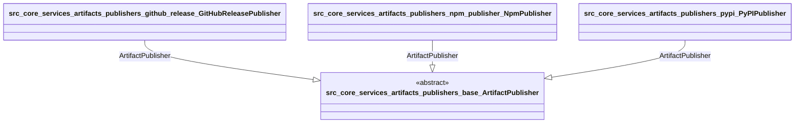

## Module Details

### core.data (10 classes)

```mermaid
classDiagram
    direction TD

    namespace src_core_data {
        class src_core_data_DataRegistry {
            + infra_services() list[dict]
            + infra_categories() dict[str, str]
            + docker_defaults() dict[str, dict]
            + docker_options() dict[str, list]
            + storage_classes() list[dict]
            + k8s_kinds() list[str]
            + card_labels() dict[str, str]
            + iac_providers() dict[str, dict]
            + mesh_annotations() dict[str, dict]
            + terraform_providers() dict[str, dict]
            + terraform_backends() dict[str, str]
            + terraform_k8s() dict[str, dict]
            + sensitive_files() list[list]
            + gitignore_patterns() dict
            + api_spec_files() list[list]
            ... 8 more methods
        }
    }

    namespace src_core_data_script_templates_lib_code_analyzer {
        class src_core_data_script_templates_lib_code_analyzer_ClassInfo {
            <<dataclass>>
            + name: str
            + qualified_name: str
            + file_path: str
            + module: str
            + bases: list[str]
            + fields: list[FieldInfo]
            + methods: list[MethodInfo]
            + is_abstract: bool
            + is_dataclass: bool
            + is_pydantic: bool
            ... 5 more fields
        }
        class src_core_data_script_templates_lib_code_analyzer_FieldInfo {
            <<dataclass>>
            + name: str
            + type_annotation: str
            + is_class_var: bool
            + visibility: str
        }
        class src_core_data_script_templates_lib_code_analyzer_MethodInfo {
            <<dataclass>>
            + name: str
            + is_async: bool
            + is_static: bool
            + is_classmethod: bool
            + is_property: bool
            + is_abstract: bool
            + visibility: str
            + parameters: list[str]
            + return_type: str
            + decorators: list[str]
        }
        class src_core_data_script_templates_lib_code_analyzer_ProjectAnalysis {
            <<dataclass>>
            + classes: list[ClassInfo]
            + files_analyzed: int
            + files_with_errors: int
            + total_classes: int
            + analysis_errors: list[str]
        }
    }

    namespace src_core_data_script_templates_lib_graph_builder {
        class src_core_data_script_templates_lib_graph_builder_ClassGraph {
            <<dataclass>>
            + nodes: dict[str, GraphNode]
            + edges: list[GraphEdge]
            + title: str
            + scope: str
            + add_node(node) None
            + add_edge(edge) None
            + filter_by_package(package) ClassGraph
            + get_connected_components() list[list[str]]
            + get_orphan_nodes() list[str]
        }
        class src_core_data_script_templates_lib_graph_builder_GraphEdge {
            <<dataclass>>
            + source: str
            + target: str
            + relation: RelationType
            + label: str
            + cardinality: str
        }
        class src_core_data_script_templates_lib_graph_builder_GraphNode {
            <<dataclass>>
            + id: str
            + label: str
            + kind: str
            + package: str
            + fields: list[str]
            + methods: list[str]
            + metadata: dict
        }
        class src_core_data_script_templates_lib_graph_builder_RelationType {
        }
    }

    namespace src_core_data_script_templates_lib_mermaid_generator {
        class src_core_data_script_templates_lib_mermaid_generator_MermaidConfig {
            <<dataclass>>
            + direction: str
            + show_fields: bool
            + show_methods: bool
            + show_visibility: bool
            + max_fields: int
            + max_methods: int
            + group_by_package: bool
            + include_orphans: bool
            + theme: str
        }
    }

    src_core_data_script_templates_lib_code_analyzer_ClassInfo o-- src_core_data_script_templates_lib_code_analyzer_FieldInfo : fields
    src_core_data_script_templates_lib_code_analyzer_ClassInfo o-- src_core_data_script_templates_lib_code_analyzer_MethodInfo : methods
    src_core_data_script_templates_lib_code_analyzer_ProjectAnalysis o-- src_core_data_script_templates_lib_code_analyzer_ClassInfo : classes
    src_core_data_script_templates_lib_graph_builder_GraphEdge *-- src_core_data_script_templates_lib_graph_builder_RelationType : relation
    src_core_data_script_templates_lib_graph_builder_ClassGraph o-- src_core_data_script_templates_lib_graph_builder_GraphNode : nodes
    src_core_data_script_templates_lib_graph_builder_ClassGraph o-- src_core_data_script_templates_lib_graph_builder_GraphEdge : edges
```

### core.models (17 classes)

#### Overview

```mermaid
classDiagram
    direction TD

    namespace src_core_models_action {
        class src_core_models_action_Action {
        }
        class src_core_models_action_Receipt {
        }
    }

    namespace src_core_models_module {
        class src_core_models_module_Module {
        }
        class src_core_models_module_ModuleHealth {
        }
    }

    namespace src_core_models_project {
        class src_core_models_project_Environment {
        }
        class src_core_models_project_ExternalLinks {
        }
        class src_core_models_project_ModuleRef {
        }
        class src_core_models_project_Project {
        }
    }

    namespace src_core_models_stack {
        class src_core_models_stack_AdapterRequirement {
        }
        class src_core_models_stack_DetectionRule {
        }
        class src_core_models_stack_Stack {
        }
        class src_core_models_stack_StackCapability {
        }
    }

    namespace src_core_models_state {
        class src_core_models_state_AdapterState {
        }
        class src_core_models_state_ModuleState {
        }
        class src_core_models_state_OperationRecord {
        }
        class src_core_models_state_ProjectState {
        }
    }

    namespace src_core_models_template {
        class src_core_models_template_GeneratedFile {
        }
    }

    src_core_models_module_Module *-- src_core_models_module_ModuleHealth : health
    src_core_models_project_Project o-- src_core_models_project_Environment : environments
    src_core_models_project_Project o-- src_core_models_project_ModuleRef : modules
    src_core_models_project_Project *-- src_core_models_project_ExternalLinks : external
    src_core_models_stack_Stack o-- src_core_models_stack_AdapterRequirement : requires
    src_core_models_stack_Stack *-- src_core_models_stack_DetectionRule : detection
    src_core_models_stack_Stack o-- src_core_models_stack_StackCapability : capabilities
    src_core_models_state_ProjectState o-- src_core_models_state_ModuleState : modules
    src_core_models_state_ProjectState o-- src_core_models_state_AdapterState : adapters
    src_core_models_state_ProjectState *-- src_core_models_state_OperationRecord : last_operation
```

#### core.models.action (2 classes)

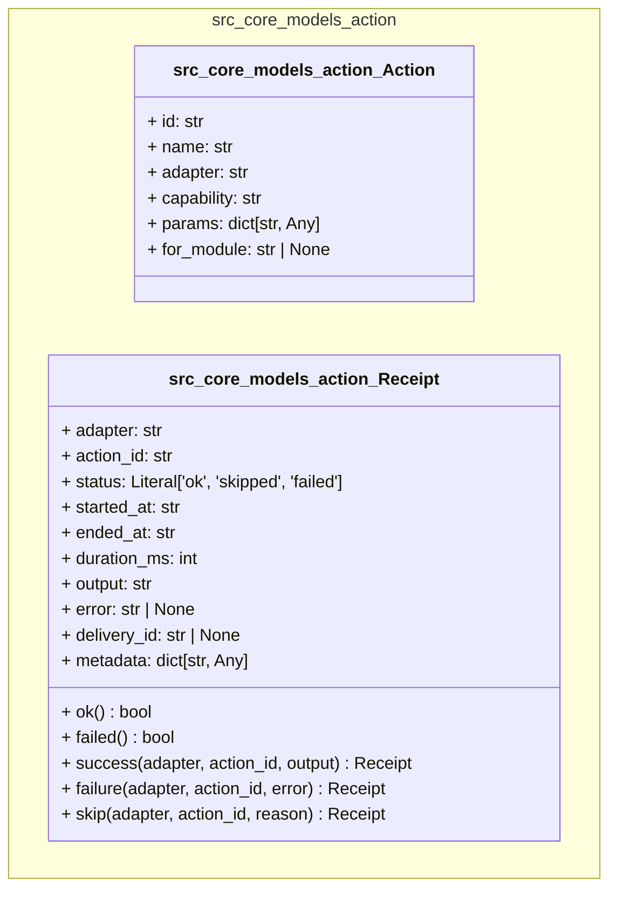

#### core.models.module (2 classes)

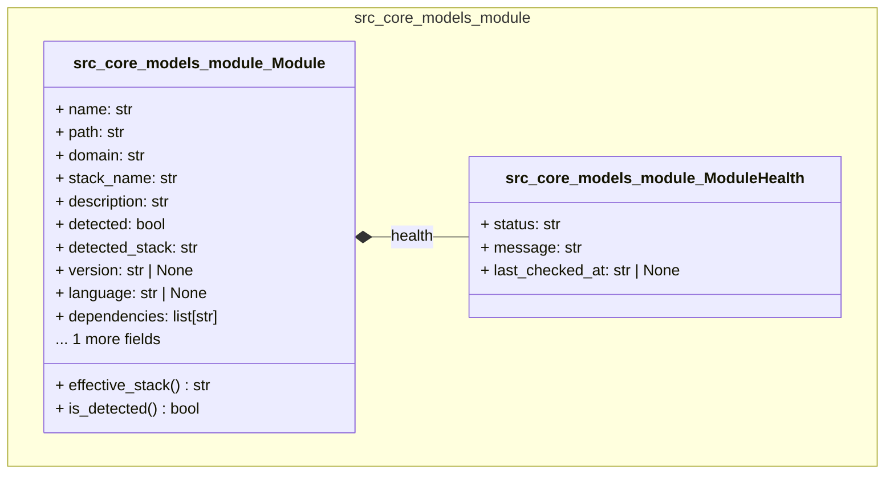

#### core.models.project (4 classes)

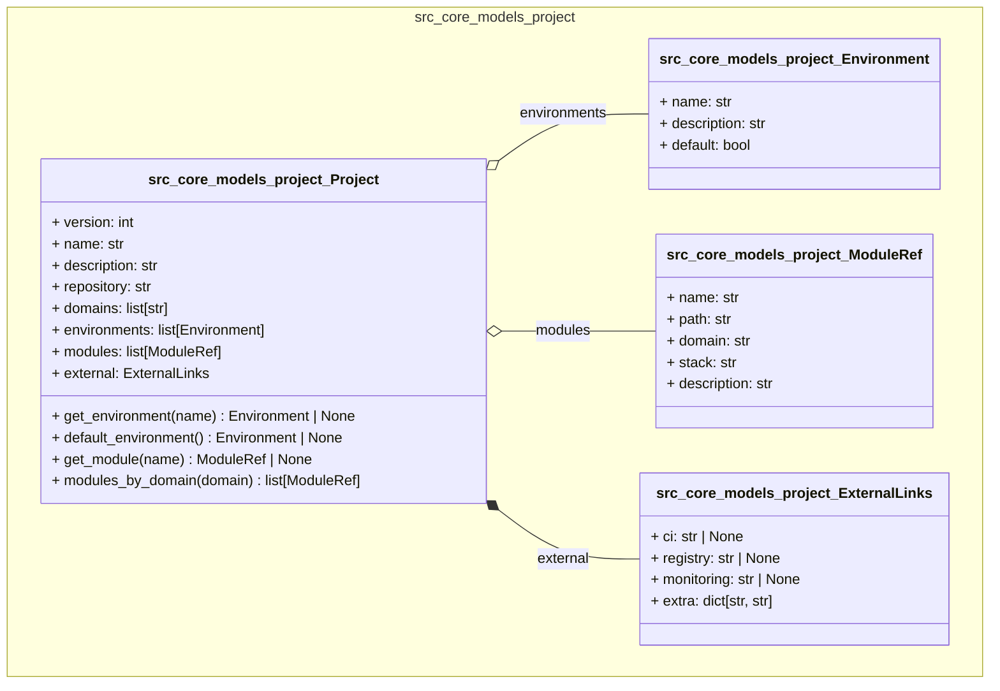

#### core.models.stack (4 classes)

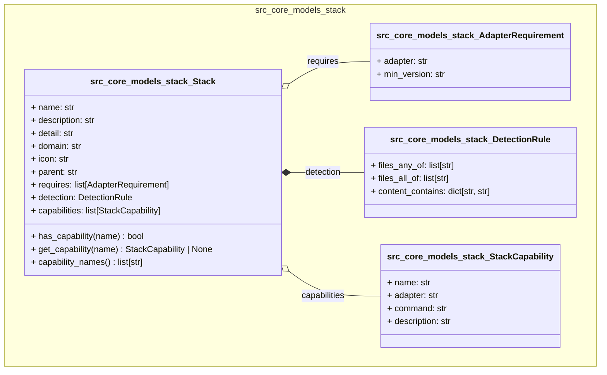

#### core.models.state (4 classes)

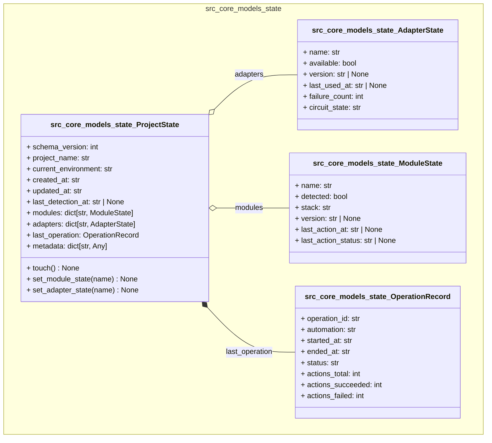

#### core.models.template (1 classes)

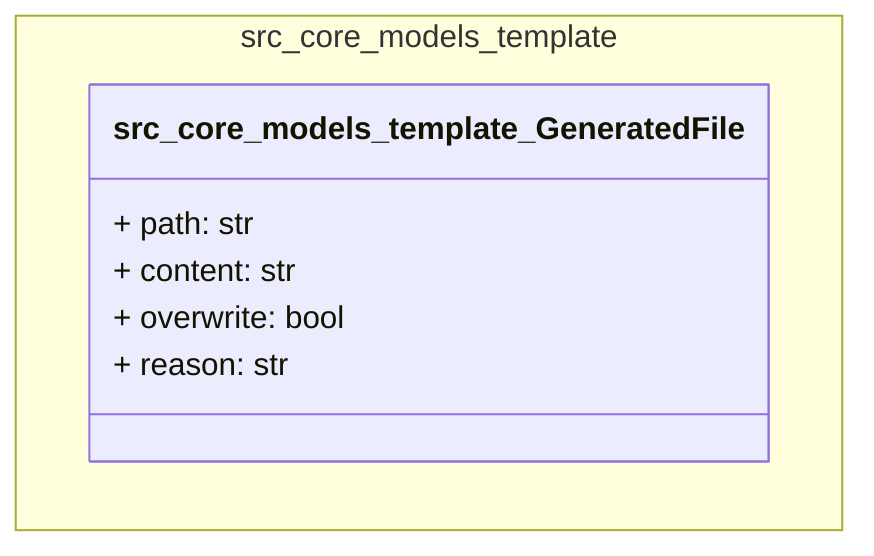

### core.observability (7 classes)

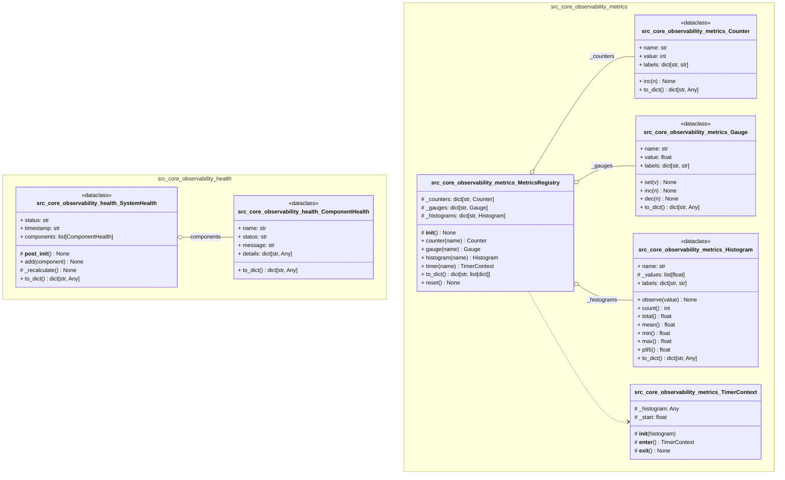

### core.reliability (5 classes)

```mermaid
classDiagram
    direction TD

    namespace src_core_reliability_circuit_breaker {
        class src_core_reliability_circuit_breaker_CircuitBreaker {
            <<dataclass>>
            + name: str
            + failure_threshold: int
            + recovery_timeout: float
            + success_threshold: int
            + state: CircuitState
            + failure_count: int
            + success_count: int
            + last_failure_time: float
            + last_state_change: float
            + total_rejections: int
            + allow_request() bool
            + record_success() None
            + record_failure() None
            + reset() None
            + to_dict() dict[str, Any]
            # _transition(new_state) None
        }
        class src_core_reliability_circuit_breaker_CircuitBreakerRegistry {
            <<dataclass>>
            + breakers: dict[str, CircuitBreaker]
            + default_threshold: int
            + default_timeout: float
            + get_or_create(name) CircuitBreaker
            + get_status() dict[str, dict[str, Any]]
            + reset_all() None
        }
        class src_core_reliability_circuit_breaker_CircuitState {
        }
    }

    namespace src_core_reliability_retry_queue {
        class src_core_reliability_retry_queue_RetryItem {
            <<dataclass>>
            + id: str
            + action_id: str
            + adapter: str
            + params: dict[str, Any]
            + attempt: int
            + max_attempts: int
            + next_retry_at: float
            + created_at: float
            + last_error: str
            + exhausted() bool
            + ready() bool
            + schedule_retry(base_delay, max_delay) None
            + to_dict() dict[str, Any]
            + from_dict(data) RetryItem
        }
        class src_core_reliability_retry_queue_RetryQueue {
            # _path: Any
            # _items: dict[str, RetryItem]
            # _max_attempts: Any
            # _base_delay: Any
            # _max_delay: Any
            # __init__(path, max_attempts, base_delay, max_delay)
            + size() int
            + ready_count() int
            + enqueue(item_id, action_id, adapter, error, params) RetryItem
            + dequeue_ready() list[RetryItem]
            + complete(item_id) None
            + fail(item_id, error) RetryItem | None
            + remove_exhausted() list[RetryItem]
            + clear() None
            + get_status() dict[str, Any]
            # _save() None
            # _load() None
        }
    }

    src_core_reliability_circuit_breaker_CircuitBreaker *-- src_core_reliability_circuit_breaker_CircuitState : state
    src_core_reliability_circuit_breaker_CircuitBreakerRegistry o-- src_core_reliability_circuit_breaker_CircuitBreaker : breakers
    src_core_reliability_retry_queue_RetryQueue o-- src_core_reliability_retry_queue_RetryItem : _items
```

### core.services (121 classes)

#### Overview

```mermaid
classDiagram
    direction TD

    namespace src_core_services_artifacts_builders_base {
        class src_core_services_artifacts_builders_base_ArtifactBuilder {
            <<abstract>>
        }
        class src_core_services_artifacts_builders_base_ArtifactStageInfo {
            <<dataclass>>
        }
    }

    namespace src_core_services_artifacts_builders_cargo {
        class src_core_services_artifacts_builders_cargo_CargoBuilder {
        }
    }

    namespace src_core_services_artifacts_builders_docker {
        class src_core_services_artifacts_builders_docker_DockerBuilder {
        }
    }

    namespace src_core_services_artifacts_builders_dotnet {
        class src_core_services_artifacts_builders_dotnet_DotnetBuilder {
        }
    }

    namespace src_core_services_artifacts_builders_gem {
        class src_core_services_artifacts_builders_gem_GemBuilder {
        }
    }

    namespace src_core_services_artifacts_builders_go {
        class src_core_services_artifacts_builders_go_GoBuilder {
        }
    }

    namespace src_core_services_artifacts_builders_gradle {
        class src_core_services_artifacts_builders_gradle_GradleBuilder {
        }
    }

    namespace src_core_services_artifacts_builders_makefile {
        class src_core_services_artifacts_builders_makefile_MakefileBuilder {
        }
    }

    namespace src_core_services_artifacts_builders_maven {
        class src_core_services_artifacts_builders_maven_MavenBuilder {
        }
    }

    namespace src_core_services_artifacts_builders_mix {
        class src_core_services_artifacts_builders_mix_MixBuilder {
        }
    }

    namespace src_core_services_artifacts_builders_npm {
        class src_core_services_artifacts_builders_npm_NpmBuilder {
        }
    }

    namespace src_core_services_artifacts_builders_pip_builder {
        class src_core_services_artifacts_builders_pip_builder_PipBuilder {
        }
    }

    namespace src_core_services_artifacts_builders_script {
        class src_core_services_artifacts_builders_script_ScriptBuilder {
        }
    }

    namespace src_core_services_artifacts_engine {
        class src_core_services_artifacts_engine_ArtifactBuildResult {
            <<dataclass>>
        }
        class src_core_services_artifacts_engine_ArtifactTarget {
            <<dataclass>>
        }
    }

    namespace src_core_services_artifacts_publishers_base {
        class src_core_services_artifacts_publishers_base_ArtifactPublishResult {
            <<dataclass>>
        }
        class src_core_services_artifacts_publishers_base_ArtifactPublisher {
            <<abstract>>
        }
    }

    namespace src_core_services_artifacts_publishers_github_release {
        class src_core_services_artifacts_publishers_github_release_GitHubReleasePublisher {
        }
    }

    namespace src_core_services_artifacts_publishers_npm_publisher {
        class src_core_services_artifacts_publishers_npm_publisher_NpmPublisher {
        }
    }

    namespace src_core_services_artifacts_publishers_pypi {
        class src_core_services_artifacts_publishers_pypi_PyPIPublisher {
        }
    }

    namespace src_core_services_audit_catalog {
        class src_core_services_audit_catalog_LibraryInfo {
        }
    }

    namespace src_core_services_audit_models {
        class src_core_services_audit_models_AuditMeta {
        }
        class src_core_services_audit_models_AuditScores {
        }
        class src_core_services_audit_models_ClientInfo {
        }
        class src_core_services_audit_models_ComponentInfo {
        }
        class src_core_services_audit_models_CrossoverInfo {
        }
        class src_core_services_audit_models_DependencyInfo {
        }
        class src_core_services_audit_models_EntrypointInfo {
        }
        class src_core_services_audit_models_L0Result {
        }
        class src_core_services_audit_models_L1ClientsResult {
        }
        class src_core_services_audit_models_L1DepsResult {
        }
        class src_core_services_audit_models_L1StructResult {
        }
        class src_core_services_audit_models_ManifestInfo {
        }
        class src_core_services_audit_models_ModuleInfo {
        }
        class src_core_services_audit_models_OSInfo {
        }
        class src_core_services_audit_models_RuntimeInfo {
        }
        class src_core_services_audit_models_ScoreBreakdownItem {
        }
        class src_core_services_audit_models_ScoreResult {
        }
        class src_core_services_audit_models_ToolInfo {
        }
    }

    namespace src_core_services_audit_narrative {
        class src_core_services_audit_narrative_Observation {
            <<dataclass>>
        }
        class src_core_services_audit_narrative_Recommendation {
            <<dataclass>>
        }
    }

    namespace src_core_services_audit_parsers {
        class src_core_services_audit_parsers_ParserRegistry {
        }
    }

    namespace src_core_services_audit_parsers__base {
        class src_core_services_audit_parsers__base_BaseParser {
            <<abstract>>
        }
        class src_core_services_audit_parsers__base_FileAnalysis {
            <<dataclass>>
        }
        class src_core_services_audit_parsers__base_FileMetrics {
            <<dataclass>>
        }
        class src_core_services_audit_parsers__base_ImportInfo {
            <<dataclass>>
        }
        class src_core_services_audit_parsers__base_SymbolInfo {
            <<dataclass>>
        }
        class src_core_services_audit_parsers__base_SymbolLocation {
            <<dataclass>>
        }
    }

    namespace src_core_services_audit_parsers__fallback {
        class src_core_services_audit_parsers__fallback_FallbackParser {
        }
    }

    namespace src_core_services_audit_parsers__rubrics {
        class src_core_services_audit_parsers__rubrics_QualityDimension {
            <<dataclass>>
        }
    }

    namespace src_core_services_audit_parsers_c_parser {
        class src_core_services_audit_parsers_c_parser_CFamilyParser {
        }
    }

    namespace src_core_services_audit_parsers_config_parser {
        class src_core_services_audit_parsers_config_parser_ConfigParser {
        }
    }

    namespace src_core_services_audit_parsers_css_parser {
        class src_core_services_audit_parsers_css_parser_CSSParser {
        }
    }

    namespace src_core_services_audit_parsers_go_parser {
        class src_core_services_audit_parsers_go_parser_GoParser {
        }
    }

    namespace src_core_services_audit_parsers_js_parser {
        class src_core_services_audit_parsers_js_parser_JavaScriptParser {
        }
    }

    namespace src_core_services_audit_parsers_jvm_parser {
        class src_core_services_audit_parsers_jvm_parser_JVMParser {
        }
    }

    namespace src_core_services_audit_parsers_multilang_parser {
        class src_core_services_audit_parsers_multilang_parser_MultiLangParser {
        }
    }

    namespace src_core_services_audit_parsers_python_parser {
        class src_core_services_audit_parsers_python_parser_PythonParser {
        }
    }

    namespace src_core_services_audit_parsers_rust_parser {
        class src_core_services_audit_parsers_rust_parser_RustParser {
        }
    }

    namespace src_core_services_audit_parsers_template_parser {
        class src_core_services_audit_parsers_template_parser_TemplateParser {
        }
    }

    namespace src_core_services_changelog_models {
        class src_core_services_changelog_models_CCMessage {
            <<dataclass>>
        }
        class src_core_services_changelog_models_Changelog {
            <<dataclass>>
        }
        class src_core_services_changelog_models_ChangelogEntry {
            <<dataclass>>
        }
        class src_core_services_changelog_models_ChangelogSection {
            <<dataclass>>
        }
    }

    namespace src_core_services_chat_models {
        class src_core_services_chat_models_ChatMessage {
        }
        class src_core_services_chat_models_MessageFlags {
        }
        class src_core_services_chat_models_Thread {
        }
    }

    namespace src_core_services_content_outline {
        class src_core_services_content_outline_CssOutlineStrategy {
        }
        class src_core_services_content_outline_EncryptedOutlineStrategy {
        }
        class src_core_services_content_outline_FallbackOutlineStrategy {
        }
        class src_core_services_content_outline_GoOutlineStrategy {
        }
        class src_core_services_content_outline_HtmlOutlineStrategy {
        }
        class src_core_services_content_outline_JavaScriptOutlineStrategy {
        }
        class src_core_services_content_outline_JsonOutlineStrategy {
        }
        class src_core_services_content_outline_MarkdownOutlineStrategy {
        }
        class src_core_services_content_outline_OutlineStrategy {
        }
        class src_core_services_content_outline_PythonOutlineStrategy {
        }
        class src_core_services_content_outline_RustOutlineStrategy {
        }
        class src_core_services_content_outline_ShellOutlineStrategy {
        }
        class src_core_services_content_outline_SqlOutlineStrategy {
        }
        class src_core_services_content_outline_TomlOutlineStrategy {
        }
        class src_core_services_content_outline_YamlOutlineStrategy {
        }
    }

    namespace src_core_services_detection {
        class src_core_services_detection_DetectionResult {
            <<dataclass>>
        }
    }

    namespace src_core_services_event_bus {
        class src_core_services_event_bus_EventBus {
        }
    }

    namespace src_core_services_ledger_models {
        class src_core_services_ledger_models_Run {
        }
        class src_core_services_ledger_models_RunEvent {
        }
    }

    namespace src_core_services_ledger_worktree {
        class src_core_services_ledger_worktree_GitIdentityError {
        }
    }

    namespace src_core_services_pages_pipeline_scanner {
        class src_core_services_pages_pipeline_scanner_DetectedCI {
            <<dataclass>>
        }
        class src_core_services_pages_pipeline_scanner_DetectedFramework {
            <<dataclass>>
        }
        class src_core_services_pages_pipeline_scanner_DetectedScript {
            <<dataclass>>
        }
        class src_core_services_pages_pipeline_scanner_PipelineScanResult {
            <<dataclass>>
        }
    }

    namespace src_core_services_pages_builders_audit_directive {
        class src_core_services_pages_builders_audit_directive_AuditDataBundle {
            <<dataclass>>
        }
        class src_core_services_pages_builders_audit_directive_AuditScope {
            <<dataclass>>
        }
        class src_core_services_pages_builders_audit_directive_DirectiveMatch {
            <<dataclass>>
        }
        class src_core_services_pages_builders_audit_directive_ScopedAuditData {
            <<dataclass>>
        }
    }

    namespace src_core_services_pages_builders_base {
        class src_core_services_pages_builders_base_BuildResult {
            <<dataclass>>
        }
        class src_core_services_pages_builders_base_BuilderInfo {
            <<dataclass>>
        }
        class src_core_services_pages_builders_base_ConfigField {
            <<dataclass>>
        }
        class src_core_services_pages_builders_base_PageBuilder {
            <<abstract>>
        }
        class src_core_services_pages_builders_base_PipelineResult {
            <<dataclass>>
        }
        class src_core_services_pages_builders_base_SegmentConfig {
            <<dataclass>>
        }
        class src_core_services_pages_builders_base_StageInfo {
            <<dataclass>>
        }
        class src_core_services_pages_builders_base_StageResult {
            <<dataclass>>
        }
    }

    namespace src_core_services_pages_builders_custom {
        class src_core_services_pages_builders_custom_CustomBuilder {
        }
    }

    namespace src_core_services_pages_builders_docusaurus {
        class src_core_services_pages_builders_docusaurus_DocusaurusBuilder {
        }
    }

    namespace src_core_services_pages_builders_hugo {
        class src_core_services_pages_builders_hugo_HugoBuilder {
        }
    }

    namespace src_core_services_pages_builders_mkdocs {
        class src_core_services_pages_builders_mkdocs_MkDocsBuilder {
        }
    }

    namespace src_core_services_pages_builders_raw {
        class src_core_services_pages_builders_raw_RawBuilder {
        }
    }

    namespace src_core_services_pages_builders_sphinx {
        class src_core_services_pages_builders_sphinx_SphinxBuilder {
        }
    }

    namespace src_core_services_peek {
        class src_core_services_peek_PeekCandidate {
            <<dataclass>>
        }
        class src_core_services_peek_PeekReference {
            <<dataclass>>
        }
        class src_core_services_peek_SymbolEntry {
            <<dataclass>>
        }
    }

    namespace src_core_services_project_index {
        class src_core_services_project_index_IndexSymbolEntry {
            <<dataclass>>
        }
        class src_core_services_project_index_ProjectIndex {
            <<dataclass>>
        }
    }

    namespace src_core_services_scripts_models {
        class src_core_services_scripts_models_ScriptConfig {
            <<dataclass>>
        }
        class src_core_services_scripts_models_ScriptMeta {
            <<dataclass>>
        }
        class src_core_services_scripts_models_ScriptParameter {
            <<dataclass>>
        }
    }

    namespace src_core_services_trace_models {
        class src_core_services_trace_models_SessionTrace {
        }
        class src_core_services_trace_models_TraceEvent {
        }
    }

    namespace src_core_services_trace_trace_recorder {
        class src_core_services_trace_trace_recorder__Recording {
        }
    }

    src_core_services_artifacts_builders_cargo_CargoBuilder --|> src_core_services_artifacts_builders_base_ArtifactBuilder : ArtifactBuilder
    src_core_services_artifacts_builders_docker_DockerBuilder --|> src_core_services_artifacts_builders_base_ArtifactBuilder : ArtifactBuilder
    src_core_services_artifacts_builders_dotnet_DotnetBuilder --|> src_core_services_artifacts_builders_base_ArtifactBuilder : ArtifactBuilder
    src_core_services_artifacts_builders_gem_GemBuilder --|> src_core_services_artifacts_builders_base_ArtifactBuilder : ArtifactBuilder
    src_core_services_artifacts_builders_go_GoBuilder --|> src_core_services_artifacts_builders_base_ArtifactBuilder : ArtifactBuilder
    src_core_services_artifacts_builders_gradle_GradleBuilder --|> src_core_services_artifacts_builders_base_ArtifactBuilder : ArtifactBuilder
    src_core_services_artifacts_builders_makefile_MakefileBuilder --|> src_core_services_artifacts_builders_base_ArtifactBuilder : ArtifactBuilder
    src_core_services_artifacts_builders_maven_MavenBuilder --|> src_core_services_artifacts_builders_base_ArtifactBuilder : ArtifactBuilder
    src_core_services_artifacts_builders_mix_MixBuilder --|> src_core_services_artifacts_builders_base_ArtifactBuilder : ArtifactBuilder
    src_core_services_artifacts_builders_npm_NpmBuilder --|> src_core_services_artifacts_builders_base_ArtifactBuilder : ArtifactBuilder
    src_core_services_artifacts_builders_pip_builder_PipBuilder --|> src_core_services_artifacts_builders_base_ArtifactBuilder : ArtifactBuilder
    src_core_services_artifacts_builders_script_ScriptBuilder --|> src_core_services_artifacts_builders_base_ArtifactBuilder : ArtifactBuilder
    src_core_services_artifacts_publishers_github_release_GitHubReleasePublisher --|> src_core_services_artifacts_publishers_base_ArtifactPublisher : ArtifactPublisher
    src_core_services_artifacts_publishers_npm_publisher_NpmPublisher --|> src_core_services_artifacts_publishers_base_ArtifactPublisher : ArtifactPublisher
    src_core_services_artifacts_publishers_pypi_PyPIPublisher --|> src_core_services_artifacts_publishers_base_ArtifactPublisher : ArtifactPublisher
    src_core_services_audit_parsers__fallback_FallbackParser --|> src_core_services_audit_parsers__base_BaseParser : BaseParser
    src_core_services_audit_parsers_c_parser_CFamilyParser --|> src_core_services_audit_parsers__base_BaseParser : BaseParser
    src_core_services_audit_parsers_config_parser_ConfigParser --|> src_core_services_audit_parsers__base_BaseParser : BaseParser
    src_core_services_audit_parsers_css_parser_CSSParser --|> src_core_services_audit_parsers__base_BaseParser : BaseParser
    src_core_services_audit_parsers_go_parser_GoParser --|> src_core_services_audit_parsers__base_BaseParser : BaseParser
    src_core_services_audit_parsers_js_parser_JavaScriptParser --|> src_core_services_audit_parsers__base_BaseParser : BaseParser
    src_core_services_audit_parsers_jvm_parser_JVMParser --|> src_core_services_audit_parsers__base_BaseParser : BaseParser
    src_core_services_audit_parsers_multilang_parser_MultiLangParser --|> src_core_services_audit_parsers__base_BaseParser : BaseParser
    src_core_services_audit_parsers_python_parser_PythonParser --|> src_core_services_audit_parsers__base_BaseParser : BaseParser
    src_core_services_audit_parsers_rust_parser_RustParser --|> src_core_services_audit_parsers__base_BaseParser : BaseParser
    src_core_services_audit_parsers_template_parser_TemplateParser --|> src_core_services_audit_parsers__base_BaseParser : BaseParser
    src_core_services_content_outline_MarkdownOutlineStrategy --|> src_core_services_content_outline_OutlineStrategy : OutlineStrategy
    src_core_services_content_outline_PythonOutlineStrategy --|> src_core_services_content_outline_OutlineStrategy : OutlineStrategy
    src_core_services_content_outline_EncryptedOutlineStrategy --|> src_core_services_content_outline_OutlineStrategy : OutlineStrategy
    src_core_services_content_outline_JavaScriptOutlineStrategy --|> src_core_services_content_outline_OutlineStrategy : OutlineStrategy
    src_core_services_content_outline_GoOutlineStrategy --|> src_core_services_content_outline_OutlineStrategy : OutlineStrategy
    src_core_services_content_outline_RustOutlineStrategy --|> src_core_services_content_outline_OutlineStrategy : OutlineStrategy
    src_core_services_content_outline_HtmlOutlineStrategy --|> src_core_services_content_outline_OutlineStrategy : OutlineStrategy
    src_core_services_content_outline_CssOutlineStrategy --|> src_core_services_content_outline_OutlineStrategy : OutlineStrategy
    src_core_services_content_outline_YamlOutlineStrategy --|> src_core_services_content_outline_OutlineStrategy : OutlineStrategy
    src_core_services_content_outline_JsonOutlineStrategy --|> src_core_services_content_outline_OutlineStrategy : OutlineStrategy
    src_core_services_content_outline_TomlOutlineStrategy --|> src_core_services_content_outline_OutlineStrategy : OutlineStrategy
    src_core_services_content_outline_ShellOutlineStrategy --|> src_core_services_content_outline_OutlineStrategy : OutlineStrategy
    src_core_services_content_outline_SqlOutlineStrategy --|> src_core_services_content_outline_OutlineStrategy : OutlineStrategy
    src_core_services_content_outline_FallbackOutlineStrategy --|> src_core_services_content_outline_OutlineStrategy : OutlineStrategy
    src_core_services_pages_builders_custom_CustomBuilder --|> src_core_services_pages_builders_base_PageBuilder : PageBuilder
    src_core_services_pages_builders_docusaurus_DocusaurusBuilder --|> src_core_services_pages_builders_base_PageBuilder : PageBuilder
    src_core_services_pages_builders_hugo_HugoBuilder --|> src_core_services_pages_builders_base_PageBuilder : PageBuilder
    src_core_services_pages_builders_mkdocs_MkDocsBuilder --|> src_core_services_pages_builders_base_PageBuilder : PageBuilder
    src_core_services_pages_builders_raw_RawBuilder --|> src_core_services_pages_builders_base_PageBuilder : PageBuilder
    src_core_services_pages_builders_sphinx_SphinxBuilder --|> src_core_services_pages_builders_base_PageBuilder : PageBuilder
    src_core_services_audit_models_L0Result *-- src_core_services_audit_models_AuditMeta : _meta
    src_core_services_audit_models_L0Result *-- src_core_services_audit_models_OSInfo : os
    src_core_services_audit_models_L0Result *-- src_core_services_audit_models_RuntimeInfo : runtime
    src_core_services_audit_models_L0Result o-- src_core_services_audit_models_ToolInfo : tools
    src_core_services_audit_models_L0Result o-- src_core_services_audit_models_ModuleInfo : modules
    src_core_services_audit_models_L0Result o-- src_core_services_audit_models_ManifestInfo : manifests
    src_core_services_audit_models_L1DepsResult *-- src_core_services_audit_models_AuditMeta : _meta
    src_core_services_audit_models_L1DepsResult o-- src_core_services_audit_models_DependencyInfo : dependencies
    src_core_services_audit_models_L1DepsResult o-- src_core_services_audit_models_CrossoverInfo : crossovers
    src_core_services_audit_models_L1StructResult *-- src_core_services_audit_models_AuditMeta : _meta
    src_core_services_audit_models_L1StructResult o-- src_core_services_audit_models_ComponentInfo : components
    src_core_services_audit_models_L1StructResult o-- src_core_services_audit_models_EntrypointInfo : entrypoints
    src_core_services_audit_models_L1ClientsResult *-- src_core_services_audit_models_AuditMeta : _meta
    src_core_services_audit_models_L1ClientsResult o-- src_core_services_audit_models_ClientInfo : clients
    src_core_services_audit_models_ScoreResult o-- src_core_services_audit_models_ScoreBreakdownItem : breakdown
    src_core_services_audit_models_AuditScores *-- src_core_services_audit_models_AuditMeta : _meta
    src_core_services_audit_models_AuditScores *-- src_core_services_audit_models_ScoreResult : complexity
    src_core_services_audit_parsers_ParserRegistry o-- src_core_services_audit_parsers__base_BaseParser : _parsers
    src_core_services_audit_parsers_ParserRegistry --> src_core_services_audit_parsers__base_BaseParser : _fallback
    src_core_services_audit_parsers__base_FileAnalysis o-- src_core_services_audit_parsers__base_ImportInfo : imports
    src_core_services_audit_parsers__base_FileAnalysis o-- src_core_services_audit_parsers__base_SymbolInfo : symbols
    src_core_services_audit_parsers__base_FileAnalysis *-- src_core_services_audit_parsers__base_FileMetrics : metrics
    src_core_services_audit_parsers__base_FileAnalysis o-- src_core_services_audit_parsers__base_SymbolLocation : symbol_locations
    src_core_services_changelog_models_Changelog *-- src_core_services_changelog_models_ChangelogSection : unreleased
    src_core_services_changelog_models_Changelog o-- src_core_services_changelog_models_ChangelogSection : releases
    src_core_services_chat_models_ChatMessage *-- src_core_services_chat_models_MessageFlags : flags
    src_core_services_pages_pipeline_scanner_PipelineScanResult o-- src_core_services_pages_pipeline_scanner_DetectedScript : scripts
    src_core_services_pages_pipeline_scanner_PipelineScanResult o-- src_core_services_pages_pipeline_scanner_DetectedFramework : frameworks
    src_core_services_pages_pipeline_scanner_PipelineScanResult o-- src_core_services_pages_pipeline_scanner_DetectedCI : ci_workflows
    src_core_services_pages_builders_audit_directive_ScopedAuditData *-- src_core_services_pages_builders_audit_directive_AuditScope : scope
    src_core_services_pages_builders_base_PipelineResult o-- src_core_services_pages_builders_base_StageResult : stages
    src_core_services_pages_builders_custom_CustomBuilder --> src_core_services_pages_builders_base_SegmentConfig : _segment
    src_core_services_scripts_models_ScriptMeta o-- src_core_services_scripts_models_ScriptParameter : parameters
    src_core_services_trace_models_SessionTrace o-- src_core_services_trace_models_TraceEvent : events
    src_core_services_audit_parsers__base_BaseParser ..> src_core_services_audit_parsers__base_FileAnalysis
    src_core_services_audit_parsers__fallback_FallbackParser ..> src_core_services_audit_parsers__base_FileAnalysis
    src_core_services_audit_parsers_c_parser_CFamilyParser ..> src_core_services_audit_parsers__base_FileAnalysis
    src_core_services_audit_parsers_config_parser_ConfigParser ..> src_core_services_audit_parsers__base_FileAnalysis
    src_core_services_audit_parsers_css_parser_CSSParser ..> src_core_services_audit_parsers__base_FileAnalysis
    src_core_services_audit_parsers_go_parser_GoParser ..> src_core_services_audit_parsers__base_FileAnalysis
    src_core_services_audit_parsers_js_parser_JavaScriptParser ..> src_core_services_audit_parsers__base_FileAnalysis
    src_core_services_audit_parsers_js_parser_JavaScriptParser ..> src_core_services_audit_parsers__base_FileMetrics
    src_core_services_audit_parsers_jvm_parser_JVMParser ..> src_core_services_audit_parsers__base_FileAnalysis
    src_core_services_audit_parsers_multilang_parser_MultiLangParser ..> src_core_services_audit_parsers__base_FileAnalysis
    src_core_services_audit_parsers_python_parser_PythonParser ..> src_core_services_audit_parsers__base_FileAnalysis
    src_core_services_audit_parsers_rust_parser_RustParser ..> src_core_services_audit_parsers__base_FileAnalysis
    src_core_services_audit_parsers_template_parser_TemplateParser ..> src_core_services_audit_parsers__base_FileAnalysis
    src_core_services_pages_builders_base_PageBuilder ..> src_core_services_pages_builders_base_BuilderInfo
    src_core_services_pages_builders_custom_CustomBuilder ..> src_core_services_pages_builders_base_BuilderInfo
    src_core_services_pages_builders_docusaurus_DocusaurusBuilder ..> src_core_services_pages_builders_base_BuilderInfo
    src_core_services_pages_builders_hugo_HugoBuilder ..> src_core_services_pages_builders_base_BuilderInfo
    src_core_services_pages_builders_mkdocs_MkDocsBuilder ..> src_core_services_pages_builders_base_BuilderInfo
    src_core_services_pages_builders_raw_RawBuilder ..> src_core_services_pages_builders_base_BuilderInfo
    src_core_services_pages_builders_sphinx_SphinxBuilder ..> src_core_services_pages_builders_base_BuilderInfo
```

#### core.services.artifacts (21 classes)

##### Overview

```mermaid
classDiagram
    direction TD

    namespace src_core_services_artifacts_builders_base {
        class src_core_services_artifacts_builders_base_ArtifactBuilder {
            <<abstract>>
        }
        class src_core_services_artifacts_builders_base_ArtifactStageInfo {
            <<dataclass>>
        }
    }

    namespace src_core_services_artifacts_builders_cargo {
        class src_core_services_artifacts_builders_cargo_CargoBuilder {
        }
    }

    namespace src_core_services_artifacts_builders_docker {
        class src_core_services_artifacts_builders_docker_DockerBuilder {
        }
    }

    namespace src_core_services_artifacts_builders_dotnet {
        class src_core_services_artifacts_builders_dotnet_DotnetBuilder {
        }
    }

    namespace src_core_services_artifacts_builders_gem {
        class src_core_services_artifacts_builders_gem_GemBuilder {
        }
    }

    namespace src_core_services_artifacts_builders_go {
        class src_core_services_artifacts_builders_go_GoBuilder {
        }
    }

    namespace src_core_services_artifacts_builders_gradle {
        class src_core_services_artifacts_builders_gradle_GradleBuilder {
        }
    }

    namespace src_core_services_artifacts_builders_makefile {
        class src_core_services_artifacts_builders_makefile_MakefileBuilder {
        }
    }

    namespace src_core_services_artifacts_builders_maven {
        class src_core_services_artifacts_builders_maven_MavenBuilder {
        }
    }

    namespace src_core_services_artifacts_builders_mix {
        class src_core_services_artifacts_builders_mix_MixBuilder {
        }
    }

    namespace src_core_services_artifacts_builders_npm {
        class src_core_services_artifacts_builders_npm_NpmBuilder {
        }
    }

    namespace src_core_services_artifacts_builders_pip_builder {
        class src_core_services_artifacts_builders_pip_builder_PipBuilder {
        }
    }

    namespace src_core_services_artifacts_builders_script {
        class src_core_services_artifacts_builders_script_ScriptBuilder {
        }
    }

    namespace src_core_services_artifacts_engine {
        class src_core_services_artifacts_engine_ArtifactBuildResult {
            <<dataclass>>
        }
        class src_core_services_artifacts_engine_ArtifactTarget {
            <<dataclass>>
        }
    }

    namespace src_core_services_artifacts_publishers_base {
        class src_core_services_artifacts_publishers_base_ArtifactPublishResult {
            <<dataclass>>
        }
        class src_core_services_artifacts_publishers_base_ArtifactPublisher {
            <<abstract>>
        }
    }

    namespace src_core_services_artifacts_publishers_github_release {
        class src_core_services_artifacts_publishers_github_release_GitHubReleasePublisher {
        }
    }

    namespace src_core_services_artifacts_publishers_npm_publisher {
        class src_core_services_artifacts_publishers_npm_publisher_NpmPublisher {
        }
    }

    namespace src_core_services_artifacts_publishers_pypi {
        class src_core_services_artifacts_publishers_pypi_PyPIPublisher {
        }
    }

    src_core_services_artifacts_builders_cargo_CargoBuilder --|> src_core_services_artifacts_builders_base_ArtifactBuilder : ArtifactBuilder
    src_core_services_artifacts_builders_docker_DockerBuilder --|> src_core_services_artifacts_builders_base_ArtifactBuilder : ArtifactBuilder
    src_core_services_artifacts_builders_dotnet_DotnetBuilder --|> src_core_services_artifacts_builders_base_ArtifactBuilder : ArtifactBuilder
    src_core_services_artifacts_builders_gem_GemBuilder --|> src_core_services_artifacts_builders_base_ArtifactBuilder : ArtifactBuilder
    src_core_services_artifacts_builders_go_GoBuilder --|> src_core_services_artifacts_builders_base_ArtifactBuilder : ArtifactBuilder
    src_core_services_artifacts_builders_gradle_GradleBuilder --|> src_core_services_artifacts_builders_base_ArtifactBuilder : ArtifactBuilder
    src_core_services_artifacts_builders_makefile_MakefileBuilder --|> src_core_services_artifacts_builders_base_ArtifactBuilder : ArtifactBuilder
    src_core_services_artifacts_builders_maven_MavenBuilder --|> src_core_services_artifacts_builders_base_ArtifactBuilder : ArtifactBuilder
    src_core_services_artifacts_builders_mix_MixBuilder --|> src_core_services_artifacts_builders_base_ArtifactBuilder : ArtifactBuilder
    src_core_services_artifacts_builders_npm_NpmBuilder --|> src_core_services_artifacts_builders_base_ArtifactBuilder : ArtifactBuilder
    src_core_services_artifacts_builders_pip_builder_PipBuilder --|> src_core_services_artifacts_builders_base_ArtifactBuilder : ArtifactBuilder
    src_core_services_artifacts_builders_script_ScriptBuilder --|> src_core_services_artifacts_builders_base_ArtifactBuilder : ArtifactBuilder
    src_core_services_artifacts_publishers_github_release_GitHubReleasePublisher --|> src_core_services_artifacts_publishers_base_ArtifactPublisher : ArtifactPublisher
    src_core_services_artifacts_publishers_npm_publisher_NpmPublisher --|> src_core_services_artifacts_publishers_base_ArtifactPublisher : ArtifactPublisher
    src_core_services_artifacts_publishers_pypi_PyPIPublisher --|> src_core_services_artifacts_publishers_base_ArtifactPublisher : ArtifactPublisher
```

#### core.services.audit (40 classes)

##### Overview

```mermaid
classDiagram
    direction TD

    namespace src_core_services_audit_catalog {
        class src_core_services_audit_catalog_LibraryInfo {
        }
    }

    namespace src_core_services_audit_models {
        class src_core_services_audit_models_AuditMeta {
        }
        class src_core_services_audit_models_AuditScores {
        }
        class src_core_services_audit_models_ClientInfo {
        }
        class src_core_services_audit_models_ComponentInfo {
        }
        class src_core_services_audit_models_CrossoverInfo {
        }
        class src_core_services_audit_models_DependencyInfo {
        }
        class src_core_services_audit_models_EntrypointInfo {
        }
        class src_core_services_audit_models_L0Result {
        }
        class src_core_services_audit_models_L1ClientsResult {
        }
        class src_core_services_audit_models_L1DepsResult {
        }
        class src_core_services_audit_models_L1StructResult {
        }
        class src_core_services_audit_models_ManifestInfo {
        }
        class src_core_services_audit_models_ModuleInfo {
        }
        class src_core_services_audit_models_OSInfo {
        }
        class src_core_services_audit_models_RuntimeInfo {
        }
        class src_core_services_audit_models_ScoreBreakdownItem {
        }
        class src_core_services_audit_models_ScoreResult {
        }
        class src_core_services_audit_models_ToolInfo {
        }
    }

    namespace src_core_services_audit_narrative {
        class src_core_services_audit_narrative_Observation {
            <<dataclass>>
        }
        class src_core_services_audit_narrative_Recommendation {
            <<dataclass>>
        }
    }

    namespace src_core_services_audit_parsers {
        class src_core_services_audit_parsers_ParserRegistry {
        }
    }

    namespace src_core_services_audit_parsers__base {
        class src_core_services_audit_parsers__base_BaseParser {
            <<abstract>>
        }
        class src_core_services_audit_parsers__base_FileAnalysis {
            <<dataclass>>
        }
        class src_core_services_audit_parsers__base_FileMetrics {
            <<dataclass>>
        }
        class src_core_services_audit_parsers__base_ImportInfo {
            <<dataclass>>
        }
        class src_core_services_audit_parsers__base_SymbolInfo {
            <<dataclass>>
        }
        class src_core_services_audit_parsers__base_SymbolLocation {
            <<dataclass>>
        }
    }

    namespace src_core_services_audit_parsers__fallback {
        class src_core_services_audit_parsers__fallback_FallbackParser {
        }
    }

    namespace src_core_services_audit_parsers__rubrics {
        class src_core_services_audit_parsers__rubrics_QualityDimension {
            <<dataclass>>
        }
    }

    namespace src_core_services_audit_parsers_c_parser {
        class src_core_services_audit_parsers_c_parser_CFamilyParser {
        }
    }

    namespace src_core_services_audit_parsers_config_parser {
        class src_core_services_audit_parsers_config_parser_ConfigParser {
        }
    }

    namespace src_core_services_audit_parsers_css_parser {
        class src_core_services_audit_parsers_css_parser_CSSParser {
        }
    }

    namespace src_core_services_audit_parsers_go_parser {
        class src_core_services_audit_parsers_go_parser_GoParser {
        }
    }

    namespace src_core_services_audit_parsers_js_parser {
        class src_core_services_audit_parsers_js_parser_JavaScriptParser {
        }
    }

    namespace src_core_services_audit_parsers_jvm_parser {
        class src_core_services_audit_parsers_jvm_parser_JVMParser {
        }
    }

    namespace src_core_services_audit_parsers_multilang_parser {
        class src_core_services_audit_parsers_multilang_parser_MultiLangParser {
        }
    }

    namespace src_core_services_audit_parsers_python_parser {
        class src_core_services_audit_parsers_python_parser_PythonParser {
        }
    }

    namespace src_core_services_audit_parsers_rust_parser {
        class src_core_services_audit_parsers_rust_parser_RustParser {
        }
    }

    namespace src_core_services_audit_parsers_template_parser {
        class src_core_services_audit_parsers_template_parser_TemplateParser {
        }
    }

    src_core_services_audit_parsers__fallback_FallbackParser --|> src_core_services_audit_parsers__base_BaseParser : BaseParser
    src_core_services_audit_parsers_c_parser_CFamilyParser --|> src_core_services_audit_parsers__base_BaseParser : BaseParser
    src_core_services_audit_parsers_config_parser_ConfigParser --|> src_core_services_audit_parsers__base_BaseParser : BaseParser
    src_core_services_audit_parsers_css_parser_CSSParser --|> src_core_services_audit_parsers__base_BaseParser : BaseParser
    src_core_services_audit_parsers_go_parser_GoParser --|> src_core_services_audit_parsers__base_BaseParser : BaseParser
    src_core_services_audit_parsers_js_parser_JavaScriptParser --|> src_core_services_audit_parsers__base_BaseParser : BaseParser
    src_core_services_audit_parsers_jvm_parser_JVMParser --|> src_core_services_audit_parsers__base_BaseParser : BaseParser
    src_core_services_audit_parsers_multilang_parser_MultiLangParser --|> src_core_services_audit_parsers__base_BaseParser : BaseParser
    src_core_services_audit_parsers_python_parser_PythonParser --|> src_core_services_audit_parsers__base_BaseParser : BaseParser
    src_core_services_audit_parsers_rust_parser_RustParser --|> src_core_services_audit_parsers__base_BaseParser : BaseParser
    src_core_services_audit_parsers_template_parser_TemplateParser --|> src_core_services_audit_parsers__base_BaseParser : BaseParser
    src_core_services_audit_models_L0Result *-- src_core_services_audit_models_AuditMeta : _meta
    src_core_services_audit_models_L0Result *-- src_core_services_audit_models_OSInfo : os
    src_core_services_audit_models_L0Result *-- src_core_services_audit_models_RuntimeInfo : runtime
    src_core_services_audit_models_L0Result o-- src_core_services_audit_models_ToolInfo : tools
    src_core_services_audit_models_L0Result o-- src_core_services_audit_models_ModuleInfo : modules
    src_core_services_audit_models_L0Result o-- src_core_services_audit_models_ManifestInfo : manifests
    src_core_services_audit_models_L1DepsResult *-- src_core_services_audit_models_AuditMeta : _meta
    src_core_services_audit_models_L1DepsResult o-- src_core_services_audit_models_DependencyInfo : dependencies
    src_core_services_audit_models_L1DepsResult o-- src_core_services_audit_models_CrossoverInfo : crossovers
    src_core_services_audit_models_L1StructResult *-- src_core_services_audit_models_AuditMeta : _meta
    src_core_services_audit_models_L1StructResult o-- src_core_services_audit_models_ComponentInfo : components
    src_core_services_audit_models_L1StructResult o-- src_core_services_audit_models_EntrypointInfo : entrypoints
    src_core_services_audit_models_L1ClientsResult *-- src_core_services_audit_models_AuditMeta : _meta
    src_core_services_audit_models_L1ClientsResult o-- src_core_services_audit_models_ClientInfo : clients
    src_core_services_audit_models_ScoreResult o-- src_core_services_audit_models_ScoreBreakdownItem : breakdown
    src_core_services_audit_models_AuditScores *-- src_core_services_audit_models_AuditMeta : _meta
    src_core_services_audit_models_AuditScores *-- src_core_services_audit_models_ScoreResult : complexity
    src_core_services_audit_parsers_ParserRegistry o-- src_core_services_audit_parsers__base_BaseParser : _parsers
    src_core_services_audit_parsers_ParserRegistry --> src_core_services_audit_parsers__base_BaseParser : _fallback
    src_core_services_audit_parsers__base_FileAnalysis o-- src_core_services_audit_parsers__base_ImportInfo : imports
    src_core_services_audit_parsers__base_FileAnalysis o-- src_core_services_audit_parsers__base_SymbolInfo : symbols
    src_core_services_audit_parsers__base_FileAnalysis *-- src_core_services_audit_parsers__base_FileMetrics : metrics
    src_core_services_audit_parsers__base_FileAnalysis o-- src_core_services_audit_parsers__base_SymbolLocation : symbol_locations
    src_core_services_audit_parsers__base_BaseParser ..> src_core_services_audit_parsers__base_FileAnalysis
    src_core_services_audit_parsers__fallback_FallbackParser ..> src_core_services_audit_parsers__base_FileAnalysis
    src_core_services_audit_parsers_c_parser_CFamilyParser ..> src_core_services_audit_parsers__base_FileAnalysis
    src_core_services_audit_parsers_config_parser_ConfigParser ..> src_core_services_audit_parsers__base_FileAnalysis
    src_core_services_audit_parsers_css_parser_CSSParser ..> src_core_services_audit_parsers__base_FileAnalysis
    src_core_services_audit_parsers_go_parser_GoParser ..> src_core_services_audit_parsers__base_FileAnalysis
    src_core_services_audit_parsers_js_parser_JavaScriptParser ..> src_core_services_audit_parsers__base_FileAnalysis
    src_core_services_audit_parsers_js_parser_JavaScriptParser ..> src_core_services_audit_parsers__base_FileMetrics
    src_core_services_audit_parsers_jvm_parser_JVMParser ..> src_core_services_audit_parsers__base_FileAnalysis
    src_core_services_audit_parsers_multilang_parser_MultiLangParser ..> src_core_services_audit_parsers__base_FileAnalysis
    src_core_services_audit_parsers_python_parser_PythonParser ..> src_core_services_audit_parsers__base_FileAnalysis
    src_core_services_audit_parsers_rust_parser_RustParser ..> src_core_services_audit_parsers__base_FileAnalysis
    src_core_services_audit_parsers_template_parser_TemplateParser ..> src_core_services_audit_parsers__base_FileAnalysis
```

#### core.services.changelog (4 classes)

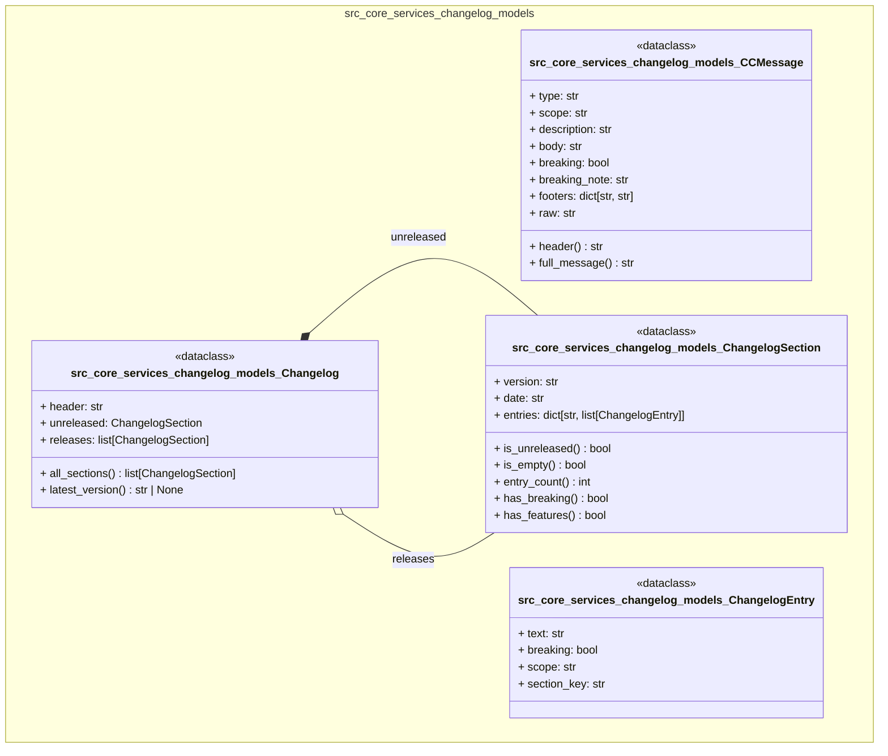

#### core.services.chat (3 classes)

```mermaid
classDiagram
    direction TD

    namespace src_core_services_chat_models {
        class src_core_services_chat_models_ChatMessage {
            + id: str
            + ts: str
            + user: str
            + hostname: str
            + text: str
            + thread_id: str | None
            + run_id: str | None
            + trace_id: str | None
            + refs: list[str]
            + source: Literal['manual', 'trace', 'system']
            ... 1 more fields
            + ensure_id() str
            + to_jsonl() str
            + from_jsonl(line) ChatMessage
        }
        class src_core_services_chat_models_MessageFlags {
            + publish: bool
            + encrypted: bool
        }
        class src_core_services_chat_models_Thread {
            + thread_id: str
            + title: str
            + created_at: str
            + created_by: str
            + anchor_run: str | None
            + tags: list[str]
            + ensure_id() str
        }
    }

    src_core_services_chat_models_ChatMessage *-- src_core_services_chat_models_MessageFlags : flags
```

#### core.services.content (15 classes)

```mermaid
classDiagram
    direction TD

    namespace src_core_services_content_outline {
        class src_core_services_content_outline_CssOutlineStrategy {
            + extract(source, file_path) list[dict]
        }
        class src_core_services_content_outline_EncryptedOutlineStrategy {
            + extract(source, file_path) list[dict]
        }
        class src_core_services_content_outline_FallbackOutlineStrategy {
            + extract(source, file_path) list[dict]
        }
        class src_core_services_content_outline_GoOutlineStrategy {
            + extract(source, file_path) list[dict]
        }
        class src_core_services_content_outline_HtmlOutlineStrategy {
            + extract(source, file_path) list[dict]
        }
        class src_core_services_content_outline_JavaScriptOutlineStrategy {
            + extract(source, file_path) list[dict]
        }
        class src_core_services_content_outline_JsonOutlineStrategy {
            + extract(source, file_path) list[dict]
            # _find_key_line(lines, key, found) int
        }
        class src_core_services_content_outline_MarkdownOutlineStrategy {
            + extract(source, file_path) list[dict]
        }
        class src_core_services_content_outline_OutlineStrategy {
            + extensions: set[str]
            + extract(source, file_path) list[dict]
        }
        class src_core_services_content_outline_PythonOutlineStrategy {
            + extract(source, file_path) list[dict]
        }
        class src_core_services_content_outline_RustOutlineStrategy {
            + extract(source, file_path) list[dict]
        }
        class src_core_services_content_outline_ShellOutlineStrategy {
            + extract(source, file_path) list[dict]
        }
        class src_core_services_content_outline_SqlOutlineStrategy {
            + extract(source, file_path) list[dict]
        }
        class src_core_services_content_outline_TomlOutlineStrategy {
            + extract(source, file_path) list[dict]
        }
        class src_core_services_content_outline_YamlOutlineStrategy {
            + extract(source, file_path) list[dict]
        }
    }

    src_core_services_content_outline_MarkdownOutlineStrategy --|> src_core_services_content_outline_OutlineStrategy : OutlineStrategy
    src_core_services_content_outline_PythonOutlineStrategy --|> src_core_services_content_outline_OutlineStrategy : OutlineStrategy
    src_core_services_content_outline_EncryptedOutlineStrategy --|> src_core_services_content_outline_OutlineStrategy : OutlineStrategy
    src_core_services_content_outline_JavaScriptOutlineStrategy --|> src_core_services_content_outline_OutlineStrategy : OutlineStrategy
    src_core_services_content_outline_GoOutlineStrategy --|> src_core_services_content_outline_OutlineStrategy : OutlineStrategy
    src_core_services_content_outline_RustOutlineStrategy --|> src_core_services_content_outline_OutlineStrategy : OutlineStrategy
    src_core_services_content_outline_HtmlOutlineStrategy --|> src_core_services_content_outline_OutlineStrategy : OutlineStrategy
    src_core_services_content_outline_CssOutlineStrategy --|> src_core_services_content_outline_OutlineStrategy : OutlineStrategy
    src_core_services_content_outline_YamlOutlineStrategy --|> src_core_services_content_outline_OutlineStrategy : OutlineStrategy
    src_core_services_content_outline_JsonOutlineStrategy --|> src_core_services_content_outline_OutlineStrategy : OutlineStrategy
    src_core_services_content_outline_TomlOutlineStrategy --|> src_core_services_content_outline_OutlineStrategy : OutlineStrategy
    src_core_services_content_outline_ShellOutlineStrategy --|> src_core_services_content_outline_OutlineStrategy : OutlineStrategy
    src_core_services_content_outline_SqlOutlineStrategy --|> src_core_services_content_outline_OutlineStrategy : OutlineStrategy
    src_core_services_content_outline_FallbackOutlineStrategy --|> src_core_services_content_outline_OutlineStrategy : OutlineStrategy
```

#### core.services.detection (1 classes)

```mermaid
classDiagram
    direction TD

    namespace src_core_services_detection {
        class src_core_services_detection_DetectionResult {
            <<dataclass>>
            + modules: list[Module]
            + unmatched_refs: list[str]
            + extra_detections: list[Module]
            + total_detected() int
            + total_modules() int
            + get_module(name) Module | None
            + to_dict() dict
        }
    }

```

#### core.services.event_bus (1 classes)

```mermaid
classDiagram
    direction TD

    namespace src_core_services_event_bus {
        class src_core_services_event_bus_EventBus {
            # _lock: Any
            # _seq: int
            # _buffer: deque[dict]
            # _subscribers: list[queue.Queue[dict]]
            # _subscriber_queue_size: Any
            # _instance_id: str
            # _latest: dict[str, dict]
            # __init__() None
            + instance_id() str
            + seq() int
            + subscriber_count() int
            + add_listener(q) None
            + remove_listener(q) None
            + publish(event_type) dict
            + subscribe() Generator[dict, None, None]
            + snapshot() dict[str, dict]
            # _make_ready_event() dict
            # _make_snapshot_event() dict
        }
    }

```

#### core.services.ledger (3 classes)

```mermaid
classDiagram
    direction TD

    namespace src_core_services_ledger_models {
        class src_core_services_ledger_models_Run {
            + run_id: str
            + type: str
            + subtype: str
            + status: Literal['ok', 'failed', 'partial']
            + user: str
            + code_ref: str
            + started_at: str
            + ended_at: str
            + duration_ms: int
            + environment: str
            ... 3 more fields
            + ensure_id() str
            + to_tag_message() str
            + from_tag_message(message) Run
        }
        class src_core_services_ledger_models_RunEvent {
            + seq: int
            + ts: str
            + type: str
            + adapter: str
            + action_id: str
            + target: str
            + status: str
            + duration_ms: int
            + detail: dict[str, Any]
        }
    }

    namespace src_core_services_ledger_worktree {
        class src_core_services_ledger_worktree_GitIdentityError {
        }
    }

```

#### core.services.pages (4 classes)

```mermaid
classDiagram
    direction TD

    namespace src_core_services_pages_pipeline_scanner {
        class src_core_services_pages_pipeline_scanner_DetectedCI {
            <<dataclass>>
            + path: str
            + name: str
            + provider: str
            + build_script: str
            + env_vars: dict
            + deploy_target: str
        }
        class src_core_services_pages_pipeline_scanner_DetectedFramework {
            <<dataclass>>
            + name: str
            + config_path: str
            + output_dir: str
            + build_cmd: str
            + preview_cmd: str
            + preview_port: int
            + version: str
        }
        class src_core_services_pages_pipeline_scanner_DetectedScript {
            <<dataclass>>
            + path: str
            + type: str
            + description: str
            + flags: list[str]
            + stages: list[dict]
            + operability: str
            + operability_notes: list[str]
            + remediation: dict
        }
        class src_core_services_pages_pipeline_scanner_PipelineScanResult {
            <<dataclass>>
            + scripts: list[DetectedScript]
            + frameworks: list[DetectedFramework]
            + ci_workflows: list[DetectedCI]
            + suggested_config: dict
            + compatibility: str
            + compatibility_notes: list[str]
        }
    }

    src_core_services_pages_pipeline_scanner_PipelineScanResult o-- src_core_services_pages_pipeline_scanner_DetectedScript : scripts
    src_core_services_pages_pipeline_scanner_PipelineScanResult o-- src_core_services_pages_pipeline_scanner_DetectedFramework : frameworks
    src_core_services_pages_pipeline_scanner_PipelineScanResult o-- src_core_services_pages_pipeline_scanner_DetectedCI : ci_workflows
```

#### core.services.pages_builders (18 classes)

##### Overview

```mermaid
classDiagram
    direction TD

    namespace src_core_services_pages_builders_audit_directive {
        class src_core_services_pages_builders_audit_directive_AuditDataBundle {
            <<dataclass>>
        }
        class src_core_services_pages_builders_audit_directive_AuditScope {
            <<dataclass>>
        }
        class src_core_services_pages_builders_audit_directive_DirectiveMatch {
            <<dataclass>>
        }
        class src_core_services_pages_builders_audit_directive_ScopedAuditData {
            <<dataclass>>
        }
    }

    namespace src_core_services_pages_builders_base {
        class src_core_services_pages_builders_base_BuildResult {
            <<dataclass>>
        }
        class src_core_services_pages_builders_base_BuilderInfo {
            <<dataclass>>
        }
        class src_core_services_pages_builders_base_ConfigField {
            <<dataclass>>
        }
        class src_core_services_pages_builders_base_PageBuilder {
            <<abstract>>
        }
        class src_core_services_pages_builders_base_PipelineResult {
            <<dataclass>>
        }
        class src_core_services_pages_builders_base_SegmentConfig {
            <<dataclass>>
        }
        class src_core_services_pages_builders_base_StageInfo {
            <<dataclass>>
        }
        class src_core_services_pages_builders_base_StageResult {
            <<dataclass>>
        }
    }

    namespace src_core_services_pages_builders_custom {
        class src_core_services_pages_builders_custom_CustomBuilder {
        }
    }

    namespace src_core_services_pages_builders_docusaurus {
        class src_core_services_pages_builders_docusaurus_DocusaurusBuilder {
        }
    }

    namespace src_core_services_pages_builders_hugo {
        class src_core_services_pages_builders_hugo_HugoBuilder {
        }
    }

    namespace src_core_services_pages_builders_mkdocs {
        class src_core_services_pages_builders_mkdocs_MkDocsBuilder {
        }
    }

    namespace src_core_services_pages_builders_raw {
        class src_core_services_pages_builders_raw_RawBuilder {
        }
    }

    namespace src_core_services_pages_builders_sphinx {
        class src_core_services_pages_builders_sphinx_SphinxBuilder {
        }
    }

    src_core_services_pages_builders_custom_CustomBuilder --|> src_core_services_pages_builders_base_PageBuilder : PageBuilder
    src_core_services_pages_builders_docusaurus_DocusaurusBuilder --|> src_core_services_pages_builders_base_PageBuilder : PageBuilder
    src_core_services_pages_builders_hugo_HugoBuilder --|> src_core_services_pages_builders_base_PageBuilder : PageBuilder
    src_core_services_pages_builders_mkdocs_MkDocsBuilder --|> src_core_services_pages_builders_base_PageBuilder : PageBuilder
    src_core_services_pages_builders_raw_RawBuilder --|> src_core_services_pages_builders_base_PageBuilder : PageBuilder
    src_core_services_pages_builders_sphinx_SphinxBuilder --|> src_core_services_pages_builders_base_PageBuilder : PageBuilder
    src_core_services_pages_builders_audit_directive_ScopedAuditData *-- src_core_services_pages_builders_audit_directive_AuditScope : scope
    src_core_services_pages_builders_base_PipelineResult o-- src_core_services_pages_builders_base_StageResult : stages
    src_core_services_pages_builders_custom_CustomBuilder --> src_core_services_pages_builders_base_SegmentConfig : _segment
    src_core_services_pages_builders_base_PageBuilder ..> src_core_services_pages_builders_base_BuilderInfo
    src_core_services_pages_builders_custom_CustomBuilder ..> src_core_services_pages_builders_base_BuilderInfo
    src_core_services_pages_builders_docusaurus_DocusaurusBuilder ..> src_core_services_pages_builders_base_BuilderInfo
    src_core_services_pages_builders_hugo_HugoBuilder ..> src_core_services_pages_builders_base_BuilderInfo
    src_core_services_pages_builders_mkdocs_MkDocsBuilder ..> src_core_services_pages_builders_base_BuilderInfo
    src_core_services_pages_builders_raw_RawBuilder ..> src_core_services_pages_builders_base_BuilderInfo
    src_core_services_pages_builders_sphinx_SphinxBuilder ..> src_core_services_pages_builders_base_BuilderInfo
```

#### core.services.peek (3 classes)

```mermaid
classDiagram
    direction TD

    namespace src_core_services_peek {
        class src_core_services_peek_PeekCandidate {
            <<dataclass>>
            + text: str
            + type: str
            + candidate_path: str
            + line_number: int | None
            + in_code_fence: bool
        }
        class src_core_services_peek_PeekReference {
            <<dataclass>>
            + text: str
            + type: str
            + resolved_path: str
            + line_number: int | None
            + is_directory: bool
        }
        class src_core_services_peek_SymbolEntry {
            <<dataclass>>
            + name: str
            + file: str
            + line: int
            + kind: str
        }
    }

```

#### core.services.project_index (2 classes)

```mermaid
classDiagram
    direction TD

    namespace src_core_services_project_index {
        class src_core_services_project_index_IndexSymbolEntry {
            <<dataclass>>
            + name: str
            + file: str
            + line: int
            + kind: str
        }
        class src_core_services_project_index_ProjectIndex {
            <<dataclass>>
            + file_map: dict[str, list[str]]
            + dir_map: dict[str, list[str]]
            + all_paths: set[str]
            + symbol_map: dict[str, list[IndexSymbolEntry]]
            + peek_cache: dict[str, dict[str, list[dict]]]
            + ready: bool
            + symbols_ready: bool
            + peek_cached: bool
            + building: bool
            + last_built: float
            ... 6 more fields
        }
    }

```

#### core.services.scripts (3 classes)

```mermaid
classDiagram
    direction TD

    namespace src_core_services_scripts_models {
        class src_core_services_scripts_models_ScriptConfig {
            <<dataclass>>
            + root: str
            + template_source: str
            + default_output: str
            + history_max_runs: int
            + history_persist_output: bool
            + execution_default_timeout: int
            + execution_parallel: bool
            + execution_venv_python: str
            + categories: list[str]
        }
        class src_core_services_scripts_models_ScriptMeta {
            <<dataclass>>
            + id: str
            + name: str
            + description: str
            + category: str
            + tags: list[str]
            + language: str
            + mode: str
            + timeout: int
            + parameters: list[ScriptParameter]
            + default_output: str
            ... 9 more fields
        }
        class src_core_services_scripts_models_ScriptParameter {
            <<dataclass>>
            + name: str
            + type: str
            + description: str
            + required: bool
            + default: str
            + choices: list[str]
        }
    }

    src_core_services_scripts_models_ScriptMeta o-- src_core_services_scripts_models_ScriptParameter : parameters
```

#### core.services.trace (3 classes)

```mermaid
classDiagram
    direction TD

    namespace src_core_services_trace_models {
        class src_core_services_trace_models_SessionTrace {
            + trace_id: str
            + name: str
            + classification: str
            + started_at: str
            + ended_at: str
            + user: str
            + code_ref: str
            + events: list[TraceEvent]
            + auto_summary: str
            + audit_refs: list[str]
            ... 3 more fields
            + ensure_id() str
        }
        class src_core_services_trace_models_TraceEvent {
            + seq: int
            + ts: str
            + type: str
            + key: str
            + target: str
            + result: str
            + duration_ms: int
            + detail: dict[str, Any]
        }
    }

    namespace src_core_services_trace_trace_recorder {
        class src_core_services_trace_trace_recorder__Recording {
            + trace_id: Any
            + project_root: Any
            + name: Any
            + classification: Any
            + user: Any
            + code_ref: Any
            + started_at: Any
            + q: queue.Queue[dict]
            # __init__(trace_id, project_root, name, classification, user, code_ref) None
        }
    }

    src_core_services_trace_models_SessionTrace o-- src_core_services_trace_models_TraceEvent : events
```

### core.use_cases (4 classes)

```mermaid
classDiagram
    direction TD

    namespace src_core_use_cases_config_check {
        class src_core_use_cases_config_check_ConfigCheckResult {
            <<dataclass>>
            + valid: bool
            + project: Project | None
            + config_path: Path | None
            + errors: list[str]
            + warnings: list[str]
            + to_dict() dict
        }
    }

    namespace src_core_use_cases_detect {
        class src_core_use_cases_detect_DetectResult {
            <<dataclass>>
            + detection: DetectionResult | None
            + project: Project | None
            + project_root: Path | None
            + stacks_loaded: int
            + state_saved: bool
            + error: str | None
            + to_dict() dict
        }
    }

    namespace src_core_use_cases_run {
        class src_core_use_cases_run_RunResult {
            <<dataclass>>
            + report: ExecutionReport | None
            + plan: ExecutionPlan | None
            + project: Project | None
            + project_root: Path | None
            + modules_targeted: int
            + actions_planned: int
            + error: str | None
            + to_dict() dict
        }
    }

    namespace src_core_use_cases_status {
        class src_core_use_cases_status_StatusResult {
            <<dataclass>>
            + project: Project | None
            + state: ProjectState | None
            + project_root: Path | None
            + config_path: Path | None
            + error: str | None
            + module_count: int
            + environment_count: int
            + detected_count: int
            + current_environment: str
            + to_dict() dict
        }
    }

```

### Small Modules (16 classes)

> Modules: adapters.base, adapters.containers, adapters.languages, adapters.mock, adapters.registry, adapters.shell, adapters.vcs, core.config, core.engine, core.persistence, ui.web

```mermaid
classDiagram
    direction TD

    namespace src_adapters_base {
        class src_adapters_base_Adapter {
            <<abstract>>
            + name() str
            + is_available() bool
            + validate(context) tuple[bool, str]
            + execute(context) Receipt
            # __repr__() str
        }
        class src_adapters_base_ExecutionContext {
            + action: Action
            + project_root: str
            + environment: str
            + module_path: str | None
            + dry_run: bool
            + params: dict[str, Any]
            + working_dir() str
        }
    }

    namespace src_adapters_containers_docker {
        class src_adapters_containers_docker_DockerAdapter {
            + name() str
            + is_available() bool
            + validate(context) tuple[bool, str]
            + execute(context) Receipt
            # _ps(ctx) Receipt
            # _images(ctx) Receipt
            # _build(ctx) Receipt
            # _up(ctx) Receipt
            # _down(ctx) Receipt
            # _logs(ctx) Receipt
            # _version(ctx) Receipt
            # _docker(args, ctx, timeout) str
            # _run_command(ctx, command) Receipt
        }
    }

    namespace src_adapters_languages_node {
        class src_adapters_languages_node_NodeAdapter {
            + name() str
            + is_available() bool
            # _detect_package_manager(cwd) str
            + version() str | None
            + validate(context) tuple[bool, str]
            + execute(context) Receipt
            # _get_version(ctx) Receipt
            # _run_node(ctx) Receipt
            # _install(ctx) Receipt
            # _run_script(ctx) Receipt
            # _exec(ctx, cmd, timeout) Receipt
            # _run_command(ctx, command) Receipt
        }
    }

    namespace src_adapters_languages_python {
        class src_adapters_languages_python_PythonAdapter {
            + name() str
            + is_available() bool
            # _python_cmd() str
            + version() str | None
            + validate(context) tuple[bool, str]
            + execute(context) Receipt
            # _get_version(ctx) Receipt
            # _run_script(ctx) Receipt
            # _create_venv(ctx) Receipt
            # _pip_install(ctx) Receipt
            # _exec(ctx, cmd, timeout) Receipt
            # _run_command(ctx, command) Receipt
        }
    }

    namespace src_adapters_mock {
        class src_adapters_mock_MockAdapter {
            # _name: Any
            # _available: Any
            # _default_output: Any
            # _responses: dict[str, Receipt]
            # _call_log: list[ExecutionContext]
            # __init__(adapter_name, available, default_output)
            + name() str
            + call_log() list[ExecutionContext]
            + call_count() int
            + is_available() bool
            + set_response(action_id, receipt) None
            + set_failure(action_id, error) None
            + validate(context) tuple[bool, str]
            + execute(context) Receipt
            + reset() None
        }
    }

    namespace src_adapters_registry {
        class src_adapters_registry_AdapterRegistry {
            # _adapters: dict[str, Adapter]
            # _mock_mode: Any
            # _mock_adapter: Adapter | None
            # _circuit_breakers: Any
            # __init__(mock_mode, circuit_breakers)
            + mock_mode() bool
            + set_mock_mode(enabled, mock_adapter) None
            + register(adapter) None
            + unregister(name) None
            + get(name) Adapter | None
            + list_adapters() list[str]
            + adapter_status() dict[str, dict[str, Any]]
            + execute_action(action, project_root, environment, module_path, dry_run) Receipt
        }
    }

    namespace src_adapters_shell_command {
        class src_adapters_shell_command_ShellCommandAdapter {
            + name() str
            + is_available() bool
            + validate(context) tuple[bool, str]
            + execute(context) Receipt
        }
    }

    namespace src_adapters_shell_filesystem {
        class src_adapters_shell_filesystem_FilesystemAdapter {
            + name() str
            + is_available() bool
            + validate(context) tuple[bool, str]
            + execute(context) Receipt
            # _exists(ctx, target) Receipt
            # _read(ctx, target) Receipt
            # _write(ctx, target) Receipt
            # _mkdir(ctx, target) Receipt
            # _list(ctx, target) Receipt
        }
    }

    namespace src_adapters_vcs_git {
        class src_adapters_vcs_git_GitAdapter {
            + name() str
            + is_available() bool
            + validate(context) tuple[bool, str]
            + execute(context) Receipt
            # _status(ctx) Receipt
            # _commit(ctx) Receipt
            # _push(ctx) Receipt
            # _pull(ctx) Receipt
            # _log(ctx) Receipt
            # _branch(ctx) Receipt
            # _diff(ctx) Receipt
            # _init(ctx) Receipt
            # _git(args, cwd, timeout) str
            # _run_command(ctx, command) Receipt
        }
    }

    namespace src_core_config_loader {
        class src_core_config_loader_ConfigError {
        }
    }

    namespace src_core_engine_executor {
        class src_core_engine_executor_ExecutionPlan {
            <<dataclass>>
            + operation_id: str
            + automation: str
            + actions: list[Action]
            + module_actions: dict[str, list[Action]]
            + total_actions() int
        }
        class src_core_engine_executor_ExecutionReport {
            <<dataclass>>
            + operation_id: str
            + automation: str
            + receipts: list[Receipt]
            + module_receipts: dict[str, list[Receipt]]
            + total() int
            + succeeded() int
            + failed() int
            + skipped() int
            + all_ok() bool
            + status() str
            + to_dict() dict
        }
    }

    namespace src_core_persistence_audit {
        class src_core_persistence_audit_AuditEntry {
            + timestamp: str
            + operation_id: str
            + operation_type: str
            + automation: str
            + environment: str
            + modules_affected: list[str]
            + status: str
            + actions_total: int
            + actions_succeeded: int
            + actions_failed: int
            ... 3 more fields
        }
        class src_core_persistence_audit_AuditWriter {
            # _path: Any
            # __init__(path, project_root)
            + path() Path
            + write(entry) None
            + read_all() list[AuditEntry]
            + read_recent(n) list[AuditEntry]
            + entry_count() int
        }
    }

    namespace src_ui_web_routes_audit_async_scan {
        class src_ui_web_routes_audit_async_scan_ScanTask {
            <<dataclass>>
            + task_id: str
            + status: str
            + progress: float
            + phase: str
            + phase_detail: str
            + started_at: float
            + completed_at: float
            + duration_ms: int
            + result: dict
            + error: str
        }
    }

```

## Hub Analysis

> Classes with the most connections — critical nexus points for understanding system coupling.

```mermaid
classDiagram
    direction TD

    namespace src_adapters_base {
        class src_adapters_base_Adapter {
            <<abstract>>
        }
    }

    namespace src_adapters_containers_docker {
        class src_adapters_containers_docker_DockerAdapter {
        }
    }

    namespace src_adapters_languages_node {
        class src_adapters_languages_node_NodeAdapter {
        }
    }

    namespace src_adapters_languages_python {
        class src_adapters_languages_python_PythonAdapter {
        }
    }

    namespace src_adapters_mock {
        class src_adapters_mock_MockAdapter {
        }
    }

    namespace src_adapters_registry {
        class src_adapters_registry_AdapterRegistry {
        }
    }

    namespace src_adapters_shell_command {
        class src_adapters_shell_command_ShellCommandAdapter {
        }
    }

    namespace src_adapters_shell_filesystem {
        class src_adapters_shell_filesystem_FilesystemAdapter {
        }
    }

    namespace src_adapters_vcs_git {
        class src_adapters_vcs_git_GitAdapter {
        }
    }

    namespace src_core_engine_executor {
        class src_core_engine_executor_ExecutionReport {
            <<dataclass>>
        }
    }

    namespace src_core_models_action {
        class src_core_models_action_Receipt {
        }
    }

    namespace src_core_models_project {
        class src_core_models_project_Environment {
        }
        class src_core_models_project_ExternalLinks {
        }
        class src_core_models_project_ModuleRef {
        }
        class src_core_models_project_Project {
        }
    }

    namespace src_core_services_artifacts_builders_base {
        class src_core_services_artifacts_builders_base_ArtifactBuilder {
            <<abstract>>
        }
    }

    namespace src_core_services_artifacts_builders_cargo {
        class src_core_services_artifacts_builders_cargo_CargoBuilder {
        }
    }

    namespace src_core_services_artifacts_builders_docker {
        class src_core_services_artifacts_builders_docker_DockerBuilder {
        }
    }

    namespace src_core_services_artifacts_builders_dotnet {
        class src_core_services_artifacts_builders_dotnet_DotnetBuilder {
        }
    }

    namespace src_core_services_artifacts_builders_gem {
        class src_core_services_artifacts_builders_gem_GemBuilder {
        }
    }

    namespace src_core_services_artifacts_builders_go {
        class src_core_services_artifacts_builders_go_GoBuilder {
        }
    }

    namespace src_core_services_artifacts_builders_gradle {
        class src_core_services_artifacts_builders_gradle_GradleBuilder {
        }
    }

    namespace src_core_services_artifacts_builders_makefile {
        class src_core_services_artifacts_builders_makefile_MakefileBuilder {
        }
    }

    namespace src_core_services_artifacts_builders_maven {
        class src_core_services_artifacts_builders_maven_MavenBuilder {
        }
    }

    namespace src_core_services_artifacts_builders_mix {
        class src_core_services_artifacts_builders_mix_MixBuilder {
        }
    }

    namespace src_core_services_artifacts_builders_npm {
        class src_core_services_artifacts_builders_npm_NpmBuilder {
        }
    }

    namespace src_core_services_artifacts_builders_pip_builder {
        class src_core_services_artifacts_builders_pip_builder_PipBuilder {
        }
    }

    namespace src_core_services_artifacts_builders_script {
        class src_core_services_artifacts_builders_script_ScriptBuilder {
        }
    }

    namespace src_core_services_audit_models {
        class src_core_services_audit_models_AuditMeta {
        }
        class src_core_services_audit_models_L0Result {
        }
        class src_core_services_audit_models_ManifestInfo {
        }
        class src_core_services_audit_models_ModuleInfo {
        }
        class src_core_services_audit_models_OSInfo {
        }
        class src_core_services_audit_models_RuntimeInfo {
        }
        class src_core_services_audit_models_ToolInfo {
        }
    }

    namespace src_core_services_audit_parsers {
        class src_core_services_audit_parsers_ParserRegistry {
        }
    }

    namespace src_core_services_audit_parsers__base {
        class src_core_services_audit_parsers__base_BaseParser {
            <<abstract>>
        }
        class src_core_services_audit_parsers__base_FileAnalysis {
            <<dataclass>>
        }
        class src_core_services_audit_parsers__base_FileMetrics {
            <<dataclass>>
        }
        class src_core_services_audit_parsers__base_ImportInfo {
            <<dataclass>>
        }
        class src_core_services_audit_parsers__base_SymbolInfo {
            <<dataclass>>
        }
        class src_core_services_audit_parsers__base_SymbolLocation {
            <<dataclass>>
        }
    }

    namespace src_core_services_audit_parsers__fallback {
        class src_core_services_audit_parsers__fallback_FallbackParser {
        }
    }

    namespace src_core_services_audit_parsers_c_parser {
        class src_core_services_audit_parsers_c_parser_CFamilyParser {
        }
    }

    namespace src_core_services_audit_parsers_config_parser {
        class src_core_services_audit_parsers_config_parser_ConfigParser {
        }
    }

    namespace src_core_services_audit_parsers_css_parser {
        class src_core_services_audit_parsers_css_parser_CSSParser {
        }
    }

    namespace src_core_services_audit_parsers_go_parser {
        class src_core_services_audit_parsers_go_parser_GoParser {
        }
    }

    namespace src_core_services_audit_parsers_js_parser {
        class src_core_services_audit_parsers_js_parser_JavaScriptParser {
        }
    }

    namespace src_core_services_audit_parsers_jvm_parser {
        class src_core_services_audit_parsers_jvm_parser_JVMParser {
        }
    }

    namespace src_core_services_audit_parsers_multilang_parser {
        class src_core_services_audit_parsers_multilang_parser_MultiLangParser {
        }
    }

    namespace src_core_services_audit_parsers_python_parser {
        class src_core_services_audit_parsers_python_parser_PythonParser {
        }
    }

    namespace src_core_services_audit_parsers_rust_parser {
        class src_core_services_audit_parsers_rust_parser_RustParser {
        }
    }

    namespace src_core_services_audit_parsers_template_parser {
        class src_core_services_audit_parsers_template_parser_TemplateParser {
        }
    }

    namespace src_core_services_content_outline {
        class src_core_services_content_outline_CssOutlineStrategy {
        }
        class src_core_services_content_outline_EncryptedOutlineStrategy {
        }
        class src_core_services_content_outline_FallbackOutlineStrategy {
        }
        class src_core_services_content_outline_GoOutlineStrategy {
        }
        class src_core_services_content_outline_HtmlOutlineStrategy {
        }
        class src_core_services_content_outline_JavaScriptOutlineStrategy {
        }
        class src_core_services_content_outline_JsonOutlineStrategy {
        }
        class src_core_services_content_outline_MarkdownOutlineStrategy {
        }
        class src_core_services_content_outline_OutlineStrategy {
        }
        class src_core_services_content_outline_PythonOutlineStrategy {
        }
        class src_core_services_content_outline_RustOutlineStrategy {
        }
        class src_core_services_content_outline_ShellOutlineStrategy {
        }
        class src_core_services_content_outline_SqlOutlineStrategy {
        }
        class src_core_services_content_outline_TomlOutlineStrategy {
        }
        class src_core_services_content_outline_YamlOutlineStrategy {
        }
    }

    namespace src_core_services_pages_builders_base {
        class src_core_services_pages_builders_base_BuilderInfo {
            <<dataclass>>
        }
        class src_core_services_pages_builders_base_PageBuilder {
            <<abstract>>
        }
    }

    namespace src_core_services_pages_builders_custom {
        class src_core_services_pages_builders_custom_CustomBuilder {
        }
    }

    namespace src_core_services_pages_builders_docusaurus {
        class src_core_services_pages_builders_docusaurus_DocusaurusBuilder {
        }
    }

    namespace src_core_services_pages_builders_hugo {
        class src_core_services_pages_builders_hugo_HugoBuilder {
        }
    }

    namespace src_core_services_pages_builders_mkdocs {
        class src_core_services_pages_builders_mkdocs_MkDocsBuilder {
        }
    }

    namespace src_core_services_pages_builders_raw {
        class src_core_services_pages_builders_raw_RawBuilder {
        }
    }

    namespace src_core_services_pages_builders_sphinx {
        class src_core_services_pages_builders_sphinx_SphinxBuilder {
        }
    }

    namespace src_core_use_cases_config_check {
        class src_core_use_cases_config_check_ConfigCheckResult {
            <<dataclass>>
        }
    }

    namespace src_core_use_cases_detect {
        class src_core_use_cases_detect_DetectResult {
            <<dataclass>>
        }
    }

    namespace src_core_use_cases_run {
        class src_core_use_cases_run_RunResult {
            <<dataclass>>
        }
    }

    namespace src_core_use_cases_status {
        class src_core_use_cases_status_StatusResult {
            <<dataclass>>
        }
    }

    src_adapters_containers_docker_DockerAdapter --|> src_adapters_base_Adapter : Adapter
    src_adapters_languages_node_NodeAdapter --|> src_adapters_base_Adapter : Adapter
    src_adapters_languages_python_PythonAdapter --|> src_adapters_base_Adapter : Adapter
    src_adapters_mock_MockAdapter --|> src_adapters_base_Adapter : Adapter
    src_adapters_shell_command_ShellCommandAdapter --|> src_adapters_base_Adapter : Adapter
    src_adapters_shell_filesystem_FilesystemAdapter --|> src_adapters_base_Adapter : Adapter
    src_adapters_vcs_git_GitAdapter --|> src_adapters_base_Adapter : Adapter
    src_core_services_artifacts_builders_cargo_CargoBuilder --|> src_core_services_artifacts_builders_base_ArtifactBuilder : ArtifactBuilder
    src_core_services_artifacts_builders_docker_DockerBuilder --|> src_core_services_artifacts_builders_base_ArtifactBuilder : ArtifactBuilder
    src_core_services_artifacts_builders_dotnet_DotnetBuilder --|> src_core_services_artifacts_builders_base_ArtifactBuilder : ArtifactBuilder
    src_core_services_artifacts_builders_gem_GemBuilder --|> src_core_services_artifacts_builders_base_ArtifactBuilder : ArtifactBuilder
    src_core_services_artifacts_builders_go_GoBuilder --|> src_core_services_artifacts_builders_base_ArtifactBuilder : ArtifactBuilder
    src_core_services_artifacts_builders_gradle_GradleBuilder --|> src_core_services_artifacts_builders_base_ArtifactBuilder : ArtifactBuilder
    src_core_services_artifacts_builders_makefile_MakefileBuilder --|> src_core_services_artifacts_builders_base_ArtifactBuilder : ArtifactBuilder
    src_core_services_artifacts_builders_maven_MavenBuilder --|> src_core_services_artifacts_builders_base_ArtifactBuilder : ArtifactBuilder
    src_core_services_artifacts_builders_mix_MixBuilder --|> src_core_services_artifacts_builders_base_ArtifactBuilder : ArtifactBuilder
    src_core_services_artifacts_builders_npm_NpmBuilder --|> src_core_services_artifacts_builders_base_ArtifactBuilder : ArtifactBuilder
    src_core_services_artifacts_builders_pip_builder_PipBuilder --|> src_core_services_artifacts_builders_base_ArtifactBuilder : ArtifactBuilder
    src_core_services_artifacts_builders_script_ScriptBuilder --|> src_core_services_artifacts_builders_base_ArtifactBuilder : ArtifactBuilder
    src_core_services_audit_parsers__fallback_FallbackParser --|> src_core_services_audit_parsers__base_BaseParser : BaseParser
    src_core_services_audit_parsers_c_parser_CFamilyParser --|> src_core_services_audit_parsers__base_BaseParser : BaseParser
    src_core_services_audit_parsers_config_parser_ConfigParser --|> src_core_services_audit_parsers__base_BaseParser : BaseParser
    src_core_services_audit_parsers_css_parser_CSSParser --|> src_core_services_audit_parsers__base_BaseParser : BaseParser
    src_core_services_audit_parsers_go_parser_GoParser --|> src_core_services_audit_parsers__base_BaseParser : BaseParser
    src_core_services_audit_parsers_js_parser_JavaScriptParser --|> src_core_services_audit_parsers__base_BaseParser : BaseParser
    src_core_services_audit_parsers_jvm_parser_JVMParser --|> src_core_services_audit_parsers__base_BaseParser : BaseParser
    src_core_services_audit_parsers_multilang_parser_MultiLangParser --|> src_core_services_audit_parsers__base_BaseParser : BaseParser
    src_core_services_audit_parsers_python_parser_PythonParser --|> src_core_services_audit_parsers__base_BaseParser : BaseParser
    src_core_services_audit_parsers_rust_parser_RustParser --|> src_core_services_audit_parsers__base_BaseParser : BaseParser
    src_core_services_audit_parsers_template_parser_TemplateParser --|> src_core_services_audit_parsers__base_BaseParser : BaseParser
    src_core_services_content_outline_MarkdownOutlineStrategy --|> src_core_services_content_outline_OutlineStrategy : OutlineStrategy
    src_core_services_content_outline_PythonOutlineStrategy --|> src_core_services_content_outline_OutlineStrategy : OutlineStrategy
    src_core_services_content_outline_EncryptedOutlineStrategy --|> src_core_services_content_outline_OutlineStrategy : OutlineStrategy
    src_core_services_content_outline_JavaScriptOutlineStrategy --|> src_core_services_content_outline_OutlineStrategy : OutlineStrategy
    src_core_services_content_outline_GoOutlineStrategy --|> src_core_services_content_outline_OutlineStrategy : OutlineStrategy
    src_core_services_content_outline_RustOutlineStrategy --|> src_core_services_content_outline_OutlineStrategy : OutlineStrategy
    src_core_services_content_outline_HtmlOutlineStrategy --|> src_core_services_content_outline_OutlineStrategy : OutlineStrategy
    src_core_services_content_outline_CssOutlineStrategy --|> src_core_services_content_outline_OutlineStrategy : OutlineStrategy
    src_core_services_content_outline_YamlOutlineStrategy --|> src_core_services_content_outline_OutlineStrategy : OutlineStrategy
    src_core_services_content_outline_JsonOutlineStrategy --|> src_core_services_content_outline_OutlineStrategy : OutlineStrategy
    src_core_services_content_outline_TomlOutlineStrategy --|> src_core_services_content_outline_OutlineStrategy : OutlineStrategy
    src_core_services_content_outline_ShellOutlineStrategy --|> src_core_services_content_outline_OutlineStrategy : OutlineStrategy
    src_core_services_content_outline_SqlOutlineStrategy --|> src_core_services_content_outline_OutlineStrategy : OutlineStrategy
    src_core_services_content_outline_FallbackOutlineStrategy --|> src_core_services_content_outline_OutlineStrategy : OutlineStrategy
    src_core_services_pages_builders_custom_CustomBuilder --|> src_core_services_pages_builders_base_PageBuilder : PageBuilder
    src_core_services_pages_builders_docusaurus_DocusaurusBuilder --|> src_core_services_pages_builders_base_PageBuilder : PageBuilder
    src_core_services_pages_builders_hugo_HugoBuilder --|> src_core_services_pages_builders_base_PageBuilder : PageBuilder
    src_core_services_pages_builders_mkdocs_MkDocsBuilder --|> src_core_services_pages_builders_base_PageBuilder : PageBuilder
    src_core_services_pages_builders_raw_RawBuilder --|> src_core_services_pages_builders_base_PageBuilder : PageBuilder
    src_core_services_pages_builders_sphinx_SphinxBuilder --|> src_core_services_pages_builders_base_PageBuilder : PageBuilder
    src_adapters_mock_MockAdapter o-- src_core_models_action_Receipt : _responses
    src_adapters_registry_AdapterRegistry o-- src_adapters_base_Adapter : _adapters
    src_adapters_registry_AdapterRegistry --> src_adapters_base_Adapter : _mock_adapter
    src_core_engine_executor_ExecutionReport o-- src_core_models_action_Receipt : receipts
    src_core_models_project_Project o-- src_core_models_project_Environment : environments
    src_core_models_project_Project o-- src_core_models_project_ModuleRef : modules
    src_core_models_project_Project *-- src_core_models_project_ExternalLinks : external
    src_core_services_audit_models_L0Result *-- src_core_services_audit_models_AuditMeta : _meta
    src_core_services_audit_models_L0Result *-- src_core_services_audit_models_OSInfo : os
    src_core_services_audit_models_L0Result *-- src_core_services_audit_models_RuntimeInfo : runtime
    src_core_services_audit_models_L0Result o-- src_core_services_audit_models_ToolInfo : tools
    src_core_services_audit_models_L0Result o-- src_core_services_audit_models_ModuleInfo : modules
    src_core_services_audit_models_L0Result o-- src_core_services_audit_models_ManifestInfo : manifests
    src_core_services_audit_parsers_ParserRegistry o-- src_core_services_audit_parsers__base_BaseParser : _parsers
    src_core_services_audit_parsers_ParserRegistry --> src_core_services_audit_parsers__base_BaseParser : _fallback
    src_core_services_audit_parsers__base_FileAnalysis o-- src_core_services_audit_parsers__base_ImportInfo : imports
    src_core_services_audit_parsers__base_FileAnalysis o-- src_core_services_audit_parsers__base_SymbolInfo : symbols
    src_core_services_audit_parsers__base_FileAnalysis *-- src_core_services_audit_parsers__base_FileMetrics : metrics
    src_core_services_audit_parsers__base_FileAnalysis o-- src_core_services_audit_parsers__base_SymbolLocation : symbol_locations
    src_core_use_cases_config_check_ConfigCheckResult --> src_core_models_project_Project : project
    src_core_use_cases_detect_DetectResult --> src_core_models_project_Project : project
    src_core_use_cases_run_RunResult --> src_core_models_project_Project : project
    src_core_use_cases_status_StatusResult --> src_core_models_project_Project : project
    src_adapters_base_Adapter ..> src_core_models_action_Receipt
    src_adapters_containers_docker_DockerAdapter ..> src_core_models_action_Receipt
    src_adapters_languages_node_NodeAdapter ..> src_core_models_action_Receipt
    src_adapters_languages_python_PythonAdapter ..> src_core_models_action_Receipt
    src_adapters_registry_AdapterRegistry ..> src_core_models_action_Receipt
    src_adapters_shell_command_ShellCommandAdapter ..> src_core_models_action_Receipt
    src_adapters_shell_filesystem_FilesystemAdapter ..> src_core_models_action_Receipt
    src_adapters_vcs_git_GitAdapter ..> src_core_models_action_Receipt
    src_core_services_audit_parsers__base_BaseParser ..> src_core_services_audit_parsers__base_FileAnalysis
    src_core_services_audit_parsers__fallback_FallbackParser ..> src_core_services_audit_parsers__base_FileAnalysis
    src_core_services_audit_parsers_c_parser_CFamilyParser ..> src_core_services_audit_parsers__base_FileAnalysis
    src_core_services_audit_parsers_config_parser_ConfigParser ..> src_core_services_audit_parsers__base_FileAnalysis
    src_core_services_audit_parsers_css_parser_CSSParser ..> src_core_services_audit_parsers__base_FileAnalysis
    src_core_services_audit_parsers_go_parser_GoParser ..> src_core_services_audit_parsers__base_FileAnalysis
    src_core_services_audit_parsers_js_parser_JavaScriptParser ..> src_core_services_audit_parsers__base_FileAnalysis
    src_core_services_audit_parsers_jvm_parser_JVMParser ..> src_core_services_audit_parsers__base_FileAnalysis
    src_core_services_audit_parsers_multilang_parser_MultiLangParser ..> src_core_services_audit_parsers__base_FileAnalysis
    src_core_services_audit_parsers_python_parser_PythonParser ..> src_core_services_audit_parsers__base_FileAnalysis
    src_core_services_audit_parsers_rust_parser_RustParser ..> src_core_services_audit_parsers__base_FileAnalysis
    src_core_services_audit_parsers_template_parser_TemplateParser ..> src_core_services_audit_parsers__base_FileAnalysis
    src_core_services_pages_builders_base_PageBuilder ..> src_core_services_pages_builders_base_BuilderInfo
    src_core_services_pages_builders_custom_CustomBuilder ..> src_core_services_pages_builders_base_BuilderInfo
    src_core_services_pages_builders_docusaurus_DocusaurusBuilder ..> src_core_services_pages_builders_base_BuilderInfo
    src_core_services_pages_builders_hugo_HugoBuilder ..> src_core_services_pages_builders_base_BuilderInfo
    src_core_services_pages_builders_mkdocs_MkDocsBuilder ..> src_core_services_pages_builders_base_BuilderInfo
    src_core_services_pages_builders_raw_RawBuilder ..> src_core_services_pages_builders_base_BuilderInfo
    src_core_services_pages_builders_sphinx_SphinxBuilder ..> src_core_services_pages_builders_base_BuilderInfo
```

| Class | Connections | Module |

|-------|------------|--------|

| **FileAnalysis** | 16 | src.core.services.audit.parsers._base |

| **BaseParser** | 14 | src.core.services.audit.parsers._base |

| **OutlineStrategy** | 14 | src.core.services.content.outline |

| **ArtifactBuilder** | 12 | src.core.services.artifacts.builders.base |

| **Adapter** | 10 | src.adapters.base |

| **Receipt** | 10 | src.core.models.action |

| **PageBuilder** | 7 | src.core.services.pages_builders.base |

| **Project** | 7 | src.core.models.project |

| **BuilderInfo** | 7 | src.core.services.pages_builders.base |

| **L0Result** | 6 | src.core.services.audit.models |


## Orphan Index

> 34 classes with no detected relationships. These may be utility classes, constants, or under-connected code.

| Class | Module | Kind | Fields | Methods |

|-------|--------|------|--------|--------|

| ConfigError | src.core.config.loader | class | 0 | 0 |

| DataRegistry | src.core.data | class | 0 | 23 |

| MermaidConfig | src.core.data.script_templates.lib.mermaid_generator | dataclass | 9 | 0 |

| GeneratedFile | src.core.models.template | class | 4 | 0 |

| AuditEntry | src.core.persistence.audit | class | 13 | 0 |

| AuditWriter | src.core.persistence.audit | class | 1 | 6 |

| ArtifactStageInfo | src.core.services.artifacts.builders.base | dataclass | 3 | 0 |

| ArtifactBuildResult | src.core.services.artifacts.engine | dataclass | 6 | 0 |

| ArtifactTarget | src.core.services.artifacts.engine | dataclass | 9 | 0 |

| ArtifactPublishResult | src.core.services.artifacts.publishers.base | dataclass | 8 | 0 |

| LibraryInfo | src.core.services.audit.catalog | class | 5 | 0 |

| Observation | src.core.services.audit.narrative | dataclass | 4 | 0 |

| Recommendation | src.core.services.audit.narrative | dataclass | 3 | 0 |

| QualityDimension | src.core.services.audit.parsers._rubrics | dataclass | 4 | 0 |

| CCMessage | src.core.services.changelog.models | dataclass | 8 | 2 |

| ChangelogEntry | src.core.services.changelog.models | dataclass | 4 | 0 |

| Thread | src.core.services.chat.models | class | 6 | 1 |

| EventBus | src.core.services.event_bus | class | 7 | 11 |

| Run | src.core.services.ledger.models | class | 13 | 3 |

| RunEvent | src.core.services.ledger.models | class | 9 | 0 |

| GitIdentityError | src.core.services.ledger.worktree | class | 0 | 0 |

| AuditDataBundle | src.core.services.pages_builders.audit_directive | dataclass | 9 | 0 |

| DirectiveMatch | src.core.services.pages_builders.audit_directive | dataclass | 5 | 0 |

| BuildResult | src.core.services.pages_builders.base | dataclass | 6 | 0 |

| ConfigField | src.core.services.pages_builders.base | dataclass | 9 | 0 |

| StageInfo | src.core.services.pages_builders.base | dataclass | 3 | 0 |

| PeekCandidate | src.core.services.peek | dataclass | 5 | 0 |

| PeekReference | src.core.services.peek | dataclass | 5 | 0 |

| SymbolEntry | src.core.services.peek | dataclass | 4 | 0 |

| IndexSymbolEntry | src.core.services.project_index | dataclass | 4 | 0 |

| ProjectIndex | src.core.services.project_index | dataclass | 16 | 0 |

| ScriptConfig | src.core.services.scripts.models | dataclass | 9 | 0 |

| _Recording | src.core.services.trace.trace_recorder | class | 8 | 1 |

| ScanTask | src.ui.web.routes.audit.async_scan | dataclass | 10 | 0 |

