# Class Diagram — adapters

> Generated: 2026-03-08 01:54 UTC

## Table of Contents

- [Statistics](#statistics)
- [Diagram](#diagram)
- [Class Index](#class-index)
- [Relationships](#relationships)

## Statistics

| Metric | Value |
|--------|-------|
| Files analyzed | 659 |
| Files with errors | 0 |
| Total classes | 179 |
| Nodes in graph | 10 |
| Relationships | 10 |
| ↳ aggregates | 2 |
| ↳ associates | 1 |
| ↳ inherits | 7 |
| Connected components | 1 |
| Orphan classes | 0 |
| Packages | 9 |

## Diagram

```mermaid
classDiagram
    direction TD

    namespace src_adapters_base {
        class src_adapters_base_Adapter {
            <<abstract>>
            + name() str
            + is_available() bool
            + validate(context) tuple[bool, str]
            + execute(context) Receipt
            # __repr__() str
        }
        class src_adapters_base_ExecutionContext {
            + action: Action
            + project_root: str
            + environment: str
            + module_path: str | None
            + dry_run: bool
            + params: dict[str, Any]
            + working_dir() str
        }
    }

    namespace src_adapters_containers_docker {
        class src_adapters_containers_docker_DockerAdapter {
            + name() str
            + is_available() bool
            + validate(context) tuple[bool, str]
            + execute(context) Receipt
            # _ps(ctx) Receipt
            # _images(ctx) Receipt
            # _build(ctx) Receipt
            # _up(ctx) Receipt
            # _down(ctx) Receipt
            # _logs(ctx) Receipt
            # _version(ctx) Receipt
            # _docker(args, ctx, timeout) str
            # _run_command(ctx, command) Receipt
        }
    }

    namespace src_adapters_languages_node {
        class src_adapters_languages_node_NodeAdapter {
            + name() str
            + is_available() bool
            # _detect_package_manager(cwd) str
            + version() str | None
            + validate(context) tuple[bool, str]
            + execute(context) Receipt
            # _get_version(ctx) Receipt
            # _run_node(ctx) Receipt
            # _install(ctx) Receipt
            # _run_script(ctx) Receipt
            # _exec(ctx, cmd, timeout) Receipt
            # _run_command(ctx, command) Receipt
        }
    }

    namespace src_adapters_languages_python {
        class src_adapters_languages_python_PythonAdapter {
            + name() str
            + is_available() bool
            # _python_cmd() str
            + version() str | None
            + validate(context) tuple[bool, str]
            + execute(context) Receipt
            # _get_version(ctx) Receipt
            # _run_script(ctx) Receipt
            # _create_venv(ctx) Receipt
            # _pip_install(ctx) Receipt
            # _exec(ctx, cmd, timeout) Receipt
            # _run_command(ctx, command) Receipt
        }
    }

    namespace src_adapters_mock {
        class src_adapters_mock_MockAdapter {
            # _name: Any
            # _available: Any
            # _default_output: Any
            # _responses: dict[str, Receipt]
            # _call_log: list[ExecutionContext]
            # __init__(adapter_name, available, default_output)
            + name() str
            + call_log() list[ExecutionContext]
            + call_count() int
            + is_available() bool
            + set_response(action_id, receipt) None
            + set_failure(action_id, error) None
            + validate(context) tuple[bool, str]
            + execute(context) Receipt
            + reset() None
        }
    }

    namespace src_adapters_registry {
        class src_adapters_registry_AdapterRegistry {
            # _adapters: dict[str, Adapter]
            # _mock_mode: Any
            # _mock_adapter: Adapter | None
            # _circuit_breakers: Any
            # __init__(mock_mode, circuit_breakers)
            + mock_mode() bool
            + set_mock_mode(enabled, mock_adapter) None
            + register(adapter) None
            + unregister(name) None
            + get(name) Adapter | None
            + list_adapters() list[str]
            + adapter_status() dict[str, dict[str, Any]]
            + execute_action(action, project_root, environment, module_path, dry_run) Receipt
        }
    }

    namespace src_adapters_shell_command {
        class src_adapters_shell_command_ShellCommandAdapter {
            + name() str
            + is_available() bool
            + validate(context) tuple[bool, str]
            + execute(context) Receipt
        }
    }

    namespace src_adapters_shell_filesystem {
        class src_adapters_shell_filesystem_FilesystemAdapter {
            + name() str
            + is_available() bool
            + validate(context) tuple[bool, str]
            + execute(context) Receipt
            # _exists(ctx, target) Receipt
            # _read(ctx, target) Receipt
            # _write(ctx, target) Receipt
            # _mkdir(ctx, target) Receipt
            # _list(ctx, target) Receipt
        }
    }

    namespace src_adapters_vcs_git {
        class src_adapters_vcs_git_GitAdapter {
            + name() str
            + is_available() bool
            + validate(context) tuple[bool, str]
            + execute(context) Receipt
            # _status(ctx) Receipt
            # _commit(ctx) Receipt
            # _push(ctx) Receipt
            # _pull(ctx) Receipt
            # _log(ctx) Receipt
            # _branch(ctx) Receipt
            # _diff(ctx) Receipt
            # _init(ctx) Receipt
            # _git(args, cwd, timeout) str
            # _run_command(ctx, command) Receipt
        }
    }

    src_adapters_containers_docker_DockerAdapter --|> src_adapters_base_Adapter : Adapter
    src_adapters_languages_node_NodeAdapter --|> src_adapters_base_Adapter : Adapter
    src_adapters_languages_python_PythonAdapter --|> src_adapters_base_Adapter : Adapter
    src_adapters_mock_MockAdapter --|> src_adapters_base_Adapter : Adapter
    src_adapters_shell_command_ShellCommandAdapter --|> src_adapters_base_Adapter : Adapter
    src_adapters_shell_filesystem_FilesystemAdapter --|> src_adapters_base_Adapter : Adapter
    src_adapters_vcs_git_GitAdapter --|> src_adapters_base_Adapter : Adapter
    src_adapters_mock_MockAdapter o-- src_adapters_base_ExecutionContext : _call_log
    src_adapters_registry_AdapterRegistry o-- src_adapters_base_Adapter : _adapters
    src_adapters_registry_AdapterRegistry --> src_adapters_base_Adapter : _mock_adapter
```

## Class Index

### src.adapters.base

- **Adapter** `abstract` (0 fields, 5 methods) — Abstract base class for all adapters.
- **ExecutionContext** (6 fields, 1 methods) — Everything an adapter needs to execute an action.

### src.adapters.containers.docker

- **DockerAdapter** (0 fields, 13 methods) — Docker and Docker Compose container operations.

### src.adapters.languages.node

- **NodeAdapter** (0 fields, 12 methods) — Node.js language toolchain adapter.

### src.adapters.languages.python

- **PythonAdapter** (0 fields, 12 methods) — Python language toolchain adapter.

### src.adapters.mock

- **MockAdapter** (5 fields, 10 methods) — Universal mock adapter for testing.

### src.adapters.registry

- **AdapterRegistry** (4 fields, 9 methods) — Central registry and dispatcher for adapters.

### src.adapters.shell.command

- **ShellCommandAdapter** (0 fields, 4 methods) — Execute shell commands and capture output.

### src.adapters.shell.filesystem

- **FilesystemAdapter** (0 fields, 9 methods) — File and directory operations with receipts.

### src.adapters.vcs.git

- **GitAdapter** (0 fields, 14 methods) — Git version control operations.

## Relationships

| Source | → | Target | Type | Label |
|--------|---|--------|------|-------|
| DockerAdapter | extends | Adapter | inherits | Adapter |
| NodeAdapter | extends | Adapter | inherits | Adapter |
| PythonAdapter | extends | Adapter | inherits | Adapter |
| MockAdapter | extends | Adapter | inherits | Adapter |
| MockAdapter | has-many | ExecutionContext | aggregates | _call_log [*] |
| AdapterRegistry | has-many | Adapter | aggregates | _adapters [*] |
| AdapterRegistry | knows | Adapter | associates | _mock_adapter [0..1] |
| ShellCommandAdapter | extends | Adapter | inherits | Adapter |
| FilesystemAdapter | extends | Adapter | inherits | Adapter |
| GitAdapter | extends | Adapter | inherits | Adapter |
