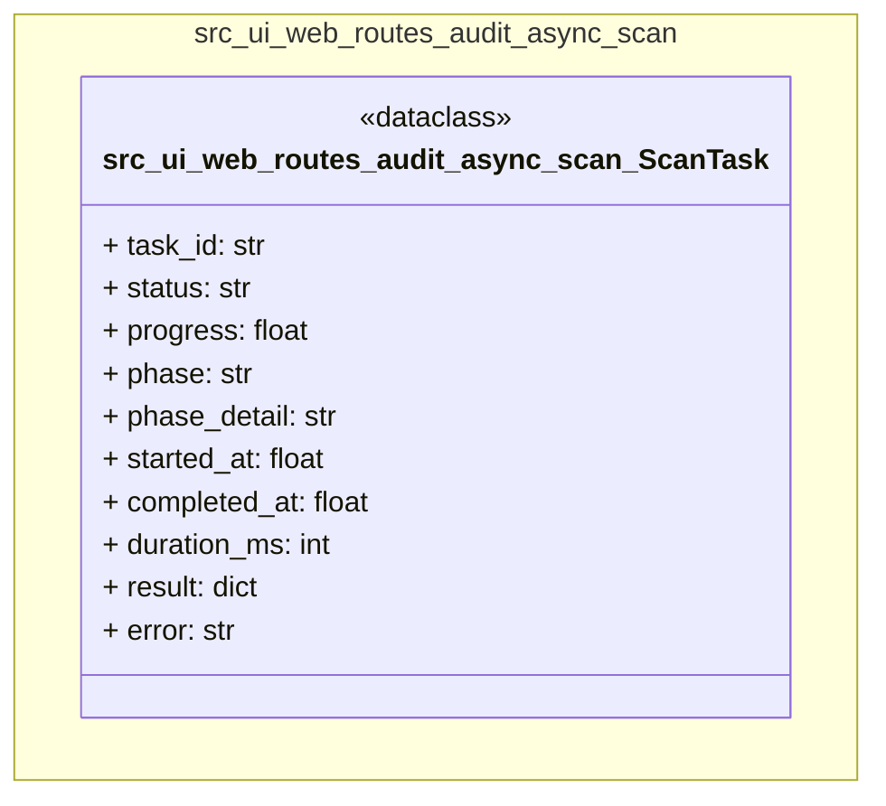

# Class Diagram — ui

> Generated: 2026-03-08 01:54 UTC

## Table of Contents

- [Statistics](#statistics)
- [Diagram](#diagram)
- [Class Index](#class-index)

## Statistics

| Metric | Value |
|--------|-------|
| Files analyzed | 659 |
| Files with errors | 0 |
| Total classes | 179 |
| Nodes in graph | 1 |
| Relationships | 0 |
| Connected components | 1 |
| Orphan classes | 1 |
| Packages | 1 |

## Diagram

## Class Index

### src.ui.web.routes.audit.async_scan

- **ScanTask** `dataclass` (10 fields, 0 methods) — In-memory state for a background audit scan.

